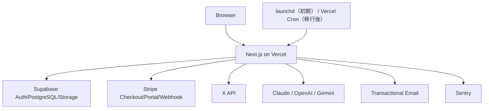

# 要件詳細 01: システム構成・環境

| 項目 | 内容 |
|---|---|
| バージョン | v1.4 |
| 更新日 | 2026-07-22 |
| 関連 | PRD A/O、要件 SC-01〜11 |

## 1. 全体構成

Space AIはNext.js単一アプリとして実装し、Vercel上でUI、API Routes、Server Actions、定時処理handlerを動かす。初期環境の永続化、認証、StorageはSupabase Free、課金はStripe、外部投稿はX API、AI実行はClaude/OpenAI/Geminiを利用する。定時handlerは初期に常時稼働Macの`launchd`から呼び、移行条件到達後にVercel Cronへ切り替える。Supabaseの移行条件は§9、実行基盤の判断は[ADR-0001](../decisions/0001-initial-infrastructure-plan.md)を正とする。

## 2. 技術スタック

| レイヤ | 技術 | 実装方針 |
|---|---|---|
| アプリ | Next.js App Router + TypeScript | UI、API、Server Actions、cronを同一リポジトリで管理 |
| UI | Tailwind CSS + shadcn/ui | 画面共通部品はApp Shell配下に集約 |
| 認証 | Supabase Auth（初期Free） | メール認証、ログイン、パスワード再設定。漏洩パスワード保護はPro移行後に有効化 |
| DB | Supabase PostgreSQL + RLS（初期Free） | すべてのユーザー系テーブルでRLSを必須化。Free中は定期的な論理backupで補完 |
| Storage | Supabase Storage | 生成画像、投稿前プレビュー画像を保存 |
| 課金 | Stripe Checkout + Customer Portal + Webhook | カード情報は自前で扱わない |
| ジョブ | Vercel Function + launchd/Vercel Cron + DBキュー | `generation_jobs`を中心に状態管理。手動操作は即時dispatch、定時トリガーは回収経路を兼ねる |
| テスト | Vitest | ユニット/統合テスト。`npm run lint` / `typecheck` / `test`をDoDの検証コマンドとする |
| 文字数検証 | 公式`twitter-text` | 加重文字数（URLはt.co固定長・CJK/絵文字重み）とcashtag抽出。投稿本文の280検証とPT-FIX判定に共用（要件05 §12・プロンプト設計書§7） |
| 不正利用防止 | Cloudflare Turnstile + Supabase Auth rate limit | signup、login、password resetを保護 |
| 暗号化 | AES-256-GCM | APIキー/OAuthトークンをアプリ層で暗号化 |
| 監視 | Sentry | Server Actions、API、cronの例外を収集 |

## 3. 環境変数

### 3.1 アプリ共通

| 変数名 | 必須環境 | 用途 | 備考 |
|---|---|---|---|
| `APP_BASE_URL` | dev/preview/prod | OAuth callback、メールリンク、Stripe return URLの基準URL | 末尾スラッシュなし |
| `APP_ENV` | dev/preview/prod | `development` / `preview` / `production` | ログ・メール文面分岐に使用 |
| `CRON_SECRET` | dev/preview/prod | launchd/Vercel Cronおよび内部job dispatch（`POST /api/jobs/run`）の呼び出し認証 | API routeでBearer検証。定時トリガーと内部dispatchで同じ値を使う。devはローカル用の値でよい。未設定時は起動を失敗させ、認証スキップのフォールバックを実装しない |
| `APP_ENCRYPTION_KEY` | dev/preview/prod | AES-256-GCM暗号化鍵 | 32 bytes相当。ローテーションは将来ADR化 |
| `X_POSTING_MODE` | dev/preview/prod | `dry_run` / `live` | dev/previewは`dry_run`を必須、prodのみ`live`可 |
| `FEATURE_QUOTE_POST_ENABLED` | dev/preview/prod | P-5引用ポストの有効化 | 既定値`false`。Server onlyで判定し、初期リリースでは有効化しない |
| `X_DAILY_POST_LIMIT` | dev/preview/prod | 1 XアカウントあたりのJST日次投稿上限 | 既定値50。スレッド内の各ポストを1件と数える |
| `X_COST_CONTENT_CREATE_USD` | preview/prod | URLなし投稿作成の原価集計単価 | 公開値0.015。Developer Console確認後に設定 |
| `X_COST_CONTENT_CREATE_WITH_URL_USD` | preview/prod | URL付き投稿作成の原価集計単価 | 公開値0.200。Developer Console確認後に設定 |
| `X_COST_INTERACTION_DELETE_USD` | preview/prod | ロールバック削除の原価集計単価 | 公開値0.010。Developer Console確認後に設定 |

### 3.2 Supabase

| 変数名 | 必須環境 | 用途 | 備考 |
|---|---|---|---|
| `NEXT_PUBLIC_SUPABASE_URL` | dev/preview/prod | Supabase client URL | Public |
| `NEXT_PUBLIC_SUPABASE_ANON_KEY` | dev/preview/prod | ブラウザ用anon key | Public |
| `SUPABASE_SERVICE_ROLE_KEY` | dev/preview/prod | cron、webhook、管理処理 | Server only。RLS bypassのため使用箇所を限定 |
| `DATABASE_URL` | dev/preview/prod | worker/cronの直接Postgres接続（Supavisor transaction modeのpooler経由） | Server only。lease・advisory lock・複文transactionに使用。Function内で接続を保持せず都度取得・即解放 |
| `SUPABASE_STORAGE_BUCKET_IMAGES` | dev/preview/prod | 生成画像保存先bucket | 既定値 `generated-images` |

### 3.3 Stripe

| 変数名 | 必須環境 | 用途 | 備考 |
|---|---|---|---|
| `STRIPE_SECRET_KEY` | dev/preview/prod | Checkout/Portal/Webhook API | Server only |
| `STRIPE_WEBHOOK_SECRET` | dev/preview/prod | Webhook署名検証 | 環境ごとに別値 |
| `STRIPE_PORTAL_CONFIGURATION_ID` | preview/prod | プラン変更・解約方針を設定したPortal configuration | 3価格を同一Product配下に置く。devは任意（Portal設定はpreview/prod運用時にsetupで作成。§9） |
| `STRIPE_PRICE_STANDARD_MONTHLY` | dev/preview/prod | 通常プラン価格ID | 500円/月 |
| `STRIPE_PRICE_MD_MONTHLY` | dev/preview/prod | mdプラン価格ID | 1,000円/月 |
| `STRIPE_PRICE_PREMIUM_MONTHLY` | dev/preview/prod | プレミアム価格ID | 2,980円/月 |

### 3.4 X API

| 変数名 | 必須環境 | 用途 | 備考 |
|---|---|---|---|
| `X_MANAGED_CLIENT_ID` | preview/prod | プレミアム用運営Developer App | BYOKではユーザー登録値を使用 |
| `X_MANAGED_CLIENT_SECRET` | 任意（confidential時） | プレミアム用運営Developer App secret | confidential clientの場合のみ必須。public/PKCE運用では不要（env検証もoptional）。環境変数管理 |
| `X_OAUTH_REDIRECT_PATH` | dev/preview/prod | OAuth callback path | 既定値 `/api/x/oauth/callback` |

### 3.5 AI・画像

| 変数名 | 必須環境 | 用途 | 備考 |
|---|---|---|---|
| `ANTHROPIC_API_KEY` | preview/prod | 共通ニュース取得（`NEWS_TEXT_PROVIDER=anthropic`時）、プレミアム文章生成/分析 | BYOKの利用者向け生成ではユーザー登録値を使用。`NEWS_TEXT_PROVIDER`を別providerへ変える場合は該当providerのキーがpreview/prod必須 |
| `OPENAI_API_KEY` | premium運用時 | プレミアム文章生成/画像生成候補 | BYOKではユーザー登録値を使用 |
| `GEMINI_API_KEY` | premium運用時 | プレミアム文章生成/画像生成候補 | BYOKではユーザー登録値を使用 |
| `PREMIUM_TEXT_PROVIDER` | premium運用時 | プレミアム文章生成/分析の既定provider | 既定値`anthropic`。`openai` / `google`への変更は明示設定時のみ |
| `NEWS_TEXT_PROVIDER` | preview/prod | 共通ニュース取得provider | 既定値`anthropic`。無効時に別providerへ自動切替しない |
| `ANTHROPIC_TEXT_MODEL` | dev/preview/prod | Claude文章モデル | 実装時に公式仕様確認 |
| `OPENAI_TEXT_MODEL` | dev/preview/prod | OpenAI文章モデル | 実装時に公式仕様確認 |
| `OPENAI_IMAGE_MODEL` | dev/preview/prod | OpenAI画像モデル | 実装時に公式仕様確認 |
| `GEMINI_TEXT_MODEL` | dev/preview/prod | Gemini文章モデル | 実装時に公式仕様確認 |
| `GEMINI_IMAGE_MODEL` | dev/preview/prod | Gemini画像モデル | 実装時に公式仕様確認 |

### 3.6 メール・監視

| 変数名 | 必須環境 | 用途 | 備考 |
|---|---|---|---|
| `SMTP_HOST` | preview/prod | Gmail SMTP host | `smtp.gmail.com` |
| `SMTP_PORT` | preview/prod | Gmail SMTP port | STARTTLSの`587` |
| `SMTP_USER` | preview/prod | Gmail SMTP user | `matsubuz.10@gmail.com` |
| `SMTP_APP_PASSWORD` | preview/prod | Gmail SMTP認証 | Server only。Google 2段階認証で発行するApp Password |
| `EMAIL_FROM` | preview/prod | Fromアドレス | `Space AI <matsubuz.10@gmail.com>` |
| `EMAIL_REPLY_TO` | preview/prod | Reply-Toアドレス | `matsubuz.10@gmail.com` |
| `SUPPORT_EMAIL` | dev/preview/prod | 問い合わせ先 | `matsubuz.10@gmail.com`。SC-11と法務ページに使用 |
| `NEXT_PUBLIC_TURNSTILE_SITE_KEY` | preview/prod | Supabase Auth CAPTCHAのsite key | signup/login/password reset |
| `TURNSTILE_SECRET_KEY` | preview/prod | Supabase Auth CAPTCHAのsecret | Server only |
| `SENTRY_DSN` | preview/prod | サーバー例外収集 | Server only |
| `NEXT_PUBLIC_SENTRY_DSN` | preview/prod | ブラウザ例外収集 | Public |

## 4. ルーティング

| 画面ID | パス | 認証 | 備考 |
|---|---|---|---|
| SC-01 | `/` | 公開 | LP |
| SC-02 | `/signup` | 公開 | 会員登録 |
| SC-03 | `/login`, `/reset-password` | 公開 | ログイン/再設定 |
| SC-04 | `/plans` | 認証必須 | Checkout開始 |
| SC-05 | `/app` | 認証必須 | ホーム |
| SC-06 | `/app/news` | 認証必須 | ニュース |
| SC-07 | `/app/posts` | 認証必須 | 投稿ハブ |
| SC-08 | `/app/schedule` | 認証必須 | スケジュール |
| SC-09 | `/app/analytics` | 認証必須 | 分析 |
| SC-10 | `/app/ai-settings` | 認証必須 | AI設定 |
| SC-11 | `/app/settings` | 認証必須 | アカウント設定 |

画面IDを持たない公開補助routeとして`/terms`、`/privacy`、`/legal/commercial-transactions`を用意する。LP、会員登録、プラン選択、アプリ設定のfooterから到達可能にする。

認証補助Route Handlerとして`GET /auth/confirm`を用意する。Supabaseメールの`token_hash`と`type`をServer側で`verifyOtp`し、signup確認は`/plans`、recoveryは`/reset-password`へ遷移する。`next`を受ける場合は許可済み相対パスだけに限定し、遷移前にURLから`token_hash`と`type`を除く。

## 5. 認証ガード

| 条件 | 挙動 |
|---|---|
| 未ログインで`/app/*`へアクセス | `/login?next=...`へリダイレクト。`next`はアプリ内相対パスだけ許可 |
| ログイン済みでプラン未選択 | `/plans`へリダイレクト |
| `subscription_status`が`incomplete`/`incomplete_expired` | `/plans`へリダイレクト。ただし`/app/settings`の課金・問い合わせタブは許可（要件03 §5の「設定・プランのみ」と対応） |
| `past_due`/`unpaid`/`paused`/`canceled` | 既存データ閲覧は許可。生成・投稿系mutationを拒否し課金バナー表示 |
| 生成・投稿系の実行前提（キー・X連携・発信設定）不足 | 画面遷移は制限しない。実行時にServer Actionがエラーコードと設定画面への導線を返し、ホームに初期設定ガイドを表示する（要件06 §3） |
| 通常プランでmd/プロンプトタブへアクセス | タブ内容はロック表示。直接編集APIも403 |
| Xアカウント未選択・active失効 | `created_at`最古の`status=active`アカウントを選択し`profiles.active_x_account_id`へ永続化する。activeが指すアカウントが`expired`/`disabled`になった場合も同じ規則で再選択し、候補がなければ`/app`で初期設定ガイドを表示 |

## 6. 実行環境の前提

- Next.js 15.1以上を使用し、Server Action/API Routeで作成した手動ジョブは`after()`からworkerへ即時dispatchする。
- worker route/functionは`maxDuration = 200`を設定し、Function開始から180秒を処理deadlineとする。1回のprovider callは最大90秒（初回call＋修復callが1 attemptに収まる）。deadline超過はタイムアウトさせ、DB上のジョブをretry対象にする。200秒はアプリ側の処理上限であり、現行VercelのFluid compute上限（Hobby 300秒／Pro 800秒）内である。商用productionではVercelのplan条件に従ってProを使用する。
- すべてのjobは「1 job = 1 worker Function呼び出し（`POST /api/jobs/run`）」でdispatchする。workerは202を即時返却し本処理を`after()`で実行する。子job（画像生成・投稿実行）も親jobのworkerが作成直後に連鎖dispatchする（要件04 §1）。
- 投稿スロットは09:00〜22:00の00分/30分に限定する。`scheduler_tick`（初期launchd）は5分間隔で起動し、スロット定刻の起動が到来スロットをenqueueした直後に各jobを個別のworker呼び出しへdispatchする。
- `after()`が中断されても`scheduler_tick`が未処理・stale lockジョブを回収する（次回回収まで最大5分）。transport失敗はlaunchd側で初回を含め最大3回再試行する。未管理のfire-and-forget Promiseは使わない。
- workerのDB接続はSupavisor transaction modeのpooler（`DATABASE_URL`）経由とする。lease・advisory lock・利用枠更新等の複文transactionはこの接続で実行し（supabase-js/PostgRESTでは実行しない）、Function内で接続を保持せず都度取得・即解放する。同時worker数はtickのdispatch上限（50）で抑える。
- launchdは常時稼働・スリープ無効・JST固定のMacで`LaunchDaemon`として実行する。設定、監視、Vercel Cronへの移行・rollbackは[運用メモ](../operations/launchd-to-vercel-cron.md)を正とする。
- 根拠: [Vercel CronのGET・認証](https://vercel.com/docs/cron-jobs/manage-cron-jobs)、[cronのplan別最小間隔](https://vercel.com/docs/cron-jobs/usage-and-pricing)、[Function duration](https://vercel.com/docs/functions/configuring-functions/duration)、[Vercel Hobby plan](https://vercel.com/docs/plans/hobby)、[Next.js `after()`](https://vercel.com/docs/functions/functions-api-reference/vercel-functions-package)

## 7. 実装時確認事項

- X API、Stripe、AI各社APIは変更が頻繁なため、実装時に公式ドキュメントを確認する。
- 外部APIの詳細差分はコード側のadapterに閉じ込め、画面・DB・ジョブの契約を変えない。
- Xの価格は公開ドキュメントではなくDeveloper Consoleの表示をリリース前に確認し、PRDの原価前提を更新する。
- 起動時に選択providerのAPIキー、model、必要機能を検証する。`NEWS_TEXT_PROVIDER`が無効ならnews cronを失敗させ、別providerへ暗黙に切り替えない。
- P-5はfeature flagの有効化後にself-serve環境で提供し、`quote_tweet_id`を投稿APIへ指定しない。対象ポスト取得による検証後、対象X URLを1ポスト目へ付けた通常投稿として送信する。
- OAuth 2.0 user contextでは運営Appも利用者本人の認可を受けて代理投稿できる。OAuth認可だけを自動投稿への同意とは扱わず、XのAutomation Rulesに従って対象操作を説明した明示同意と即時opt-outを別途実装する。
- X実装の確認先：[OAuth 2.0 scopes/PKCE](https://docs.x.com/fundamentals/authentication/oauth-2-0/authorization-code)／[X Automation Rules](https://help.x.com/en/rules-and-policies/x-automation)／[投稿作成・引用制約](https://docs.x.com/x-api/posts/create-post)／[media upload](https://docs.x.com/x-api/media/upload-media)／[metricsの30日制約](https://docs.x.com/x-api/fundamentals/metrics)／[pay-per-use価格](https://docs.x.com/x-api/getting-started/pricing)。
- Supabase実装の確認先：[Next.js認証・`token_hash`確認](https://supabase.com/docs/guides/getting-started/tutorials/with-nextjs)／[Auth rate limit](https://supabase.com/docs/guides/auth/rate-limits)／[パスワード保護](https://supabase.com/docs/guides/auth/password-security)／[本番運用チェックリスト](https://supabase.com/docs/guides/deployment/going-into-prod)。

## 8. セキュリティ基準

- production cookieは`Secure`、認証・OAuth補助cookieは`HttpOnly`、`SameSite=Lax`を既定とする。
- CSPはnonceベースとし、`frame-ancestors 'none'`、`object-src 'none'`を含める。HSTS、`X-Content-Type-Options: nosniff`、厳格なReferrer-Policyをproductionで付与する。
- service role、暗号鍵、provider key、OAuth tokenはServer only moduleからだけ参照し、Client Componentへimportできない境界を設ける。
- Sentry/logはAuthorization、cookie、API key、token、prompt全文、投稿前の非公開入力をredactする。ユーザー向けerrorへprovider本文やstack traceを出さない。
- private Storageの画像はservice roleでwriteし、表示時に短時間の署名URLを発行する。DBへ署名URLを保存しない。
- dependency audit、RLS policy test、認可・CSRF・SSRF testをリリース判定に含める。
- Supabase Authのメール送信・認証endpointにはDashboardのrate limitを設定する。signup、login、password resetは成功・失敗で情報量を変えず、連続失敗時は同じ汎用文言で待機を促す。
- productionはSupabase内蔵メールproviderを使わず、認証メールとアプリ通知の送信元をGmail SMTPの`matsubuz.10@gmail.com`へ統一する。Google Accountの通常passwordは保存せず、2段階認証で発行したApp PasswordをServer onlyで管理する。signup/login/password resetへCloudflare Turnstileを適用する。Supabase Freeでは利用できない漏洩パスワード保護はPro移行直後に有効化し、Free中は12文字以上のpassword、rate limit、Turnstileで補完する。
- 主要導線はWCAG 2.2 AAを目標に、キーボードのみで操作可能にする。focusを消さず、入力にはlabelとエラー関連付け、状態は色だけで表現しない。

## 9. バックアップ・保持

- 初期のSupabase Free運用中は自動backupがないことを受け入れ、週1回およびschemaへ影響する変更前に`supabase db dump`で論理backupを取得し、Supabase外へ暗号化保存する。初期RPOは最大7日、RTOはbest effortとする。Pro移行後は日次backupを有効化し、復元手順を確認する。必要なRPO/RTOを満たせない場合はPITRを検討する。
- SupabaseはDBまたはStorage使用量がFree上限の80%へ到達した場合、pause・backup・security制約が運用上許容できなくなった場合、日次自動backupが必要になった場合、またはpooler接続の枯渇・待ち行列が観測された場合にProへ移行する。
- `news_items`と`news`通知は40日保持し、期限後は`scheduler_tick`が1起動500件まで削除する。ダイジェストと遷移先の保持期間を一致させる。
- `external_api_usage_events`の明細は40日保持し、期限後は`scheduler_tick`が1起動500件まで削除する。40日保持により、前月分の明細は翌月10日頃まで完全に揃う。月次原価を長期比較する場合は個人・request・jobと結び付かない集計値だけを別途保持する。
- `cron_runs`（定時トリガーの重複受付防止行）は`claimed_at`から40日保持し、期限後は`scheduler_tick`が1起動500件まで削除する。`window_key`は時刻由来で単調増加するため、cleanup後に保持期間超過の過去窓が再来・再実行されることはない（要件02 §3.18、ADR-0003）。
- 運営側の確認・集計はSupabase Studio/SQLで直接行う（admin UIはMVP対象外）。ユーザー別月次原価の確認・実測分析は、明細の40日保持内（翌月10日まで）にSQLで実施する。
- 参照のないStorage画像は24時間後から1起動100件までbest effortで削除する。参照中の画像、draft、投稿履歴、base_md履歴、利用枠・課金台帳はサービス提供中保持する。法令上必要な個別対応は§9の自動保持処理と分けて運営が手作業で行う。
- Sentryとメールproviderのlog保持期間は各サービス設定で30日以下とし、秘密値・投稿前入力を送信しない。
