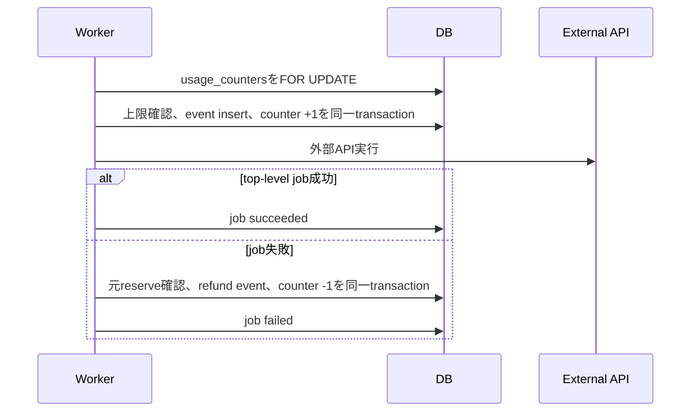

# 要件詳細 03: 認証・課金・利用枠

| 項目 | 内容 |
|---|---|
| バージョン | v1.4 |
| 更新日 | 2026-07-22 |
| 関連 | PRD A/O、SC-02〜04/SC-11 |

## 1. 認証

| 項目 | 仕様 |
|---|---|
| 登録 | Supabase Authのメール＋パスワード。確認メールを必須にする |
| ログイン | `signInWithPassword`成功後に欠損profileを補完し、`subscription_status=incomplete|incomplete_expired`は`/plans`、それ以外は安全な`next`または`/app`へ遷移する。未確認メールはアプリ本体へ入れず、確認メール再送を表示 |
| パスワード再設定 | `resetPasswordForEmail`は登録有無にかかわらず同じ受理応答を返す。recoveryリンクで確立したsessionと、user_idを束縛した15分TTLの改ざん検知HttpOnly cookieが一致するときだけ`updateUser`を許可し、成功後は両方を破棄する |
| パスワード | 12〜64文字かつUTF-8で72 bytes以下。ブラウザ・password managerの生成/貼り付けを妨げず、確認用入力と一致検証を行う |
| セッション | `@supabase/ssr`でリクエスト単位のServer clientを作り、Server Components／Server Actions／API Routeの共通helperから`getUser()`を呼んでsessionを検証する。refreshはproxyでcookieとcache禁止headerへ反映し、session tokenをブラウザclientから直接扱わない |
| profile作成 | `auth.users`のAFTER INSERT trigger（`security definer`・空`search_path`）で作成。欠損時はログイン後の初回アクセスでservice roleが`id`競合時DO NOTHINGの冪等insertを行い、既存値を更新しない |
| ログアウト | Supabase sessionを破棄し`/login`へ遷移 |

認証エラーで秘密値、メールの存在有無、外部providerレスポンス本文をそのまま表示しない。

ログイン失敗はinvalid credentials、rate limit、provider障害を同じ汎用文言へまとめる。Supabaseの安定した`email_not_confirmed`コードだけは確認メール再送状態として扱い、providerのmessage文字列では分岐しない。ログインの`next`は`/plans`、`/reset-password`、`/app`配下だけを許可し、外部URLや認証routeは破棄する。

確認メールとpassword resetメールはカスタムテンプレートから`/auth/confirm?token_hash=...&type=signup|recovery`へ直接送り、Server側の`verifyOtp`でcookie sessionを確立する。成功後はtoken情報を残さずsignupを`/plans`、recoveryを`/reset-password`へ遷移させる。recovery成功時だけ`APP_ENCRYPTION_KEY`で封緘したuser_id・発行時刻をHttpOnly／SameSite=Lax／15分TTL cookieへ保存し、password更新時に現在sessionのuser_idとの一致とTTLを検証する。期限切れ・使用済み・不正tokenまたはmarkerはprovider理由を出さない汎用エラーへまとめ、signup確認メールは再送フォーム、recoveryは再申請導線を表示する。productionはSupabase Authのrate limit、Turnstile、Gmail custom SMTPを有効化する。Supabase Freeでは利用できない漏洩パスワード保護はPro移行後に有効化する。

会員登録時は現行の利用規約versionへの明示同意とプライバシーポリシー確認を必須にし、versionと時刻をprofileへ保存する。重大改定で再同意が必要な場合は、既存データ閲覧を許可したまま生成・投稿前に同意画面を表示する。

現行versionはコード定数を正とし、法務確認前の開発版は利用規約・プライバシーポリシーとも`2026-07-22-draft`とする。`signUp`はクライアント値がこのversionと一致する場合だけSupabase Authを呼び、profile作成後にservice roleで両versionと同一の受付時刻を保存する。providerの詳細エラーやメール存在有無は画面へ返さず、確認メール再送も存在有無にかかわらず同じ受理応答とする。

## 2. プラン

| プラン | 月額税込 | Xアカウント上限 | APIキー | 月間利用枠 |
|---|---:|---:|---|---|
| `standard` | 500円 | 1 | BYOK必須 | アプリ側上限なし |
| `md` | 1,000円 | 3 | BYOK必須 | アプリ側上限なし |
| `premium` | 2,980円 | 3 | 不要 | 通常投稿200件、URL付き投稿20件、文章生成100回、画像生成20枚 |

standard/mdは利用者自身のX/AI契約へ原価が発生するため、アプリ側の月間投稿枠・生成枠を設けない。Xの自動化ルールと誤操作対策を目的とする1 Xアカウントあたり日次50ポストの安全上限は、課金主体にかかわらず全プランへ適用する。premiumは運営App・運営AIキーの原価管理のため月間利用枠も適用する。

全プラン7日間無料トライアル。Checkoutでカード登録を必須とし、trialはuser_idごとに初回1回だけ付与する。

### 2.1 Checkout作成

- `POST /api/stripe/checkout`は`{"plan":"standard|md|premium"}`だけを受け付け、未知フィールドも入力不正として拒否する。planをサーバー側の環境変数Price ID対応表で解決し、クライアントからPrice IDを受け取らない。
- Supabase sessionと`Origin === new URL(APP_BASE_URL).origin`を検証する。既存の`stripe_customer_id`を再利用し、未作成時はemailと`user_id` metadataを付け、`space-ai:customer:{user_id}`を冪等keyとしてCustomerを作成してprofileへ保存する。
- Checkout Sessionはsubscription mode、カード登録必須、quantity 1とし、session／subscriptionのmetadataおよび`client_reference_id`へ本人user_idとplanを関連付ける。
- `trial_used_at is null`の場合だけ`subscription_data.trial_period_days=7`を設定する。trialing subscriptionの同期時に`trial_used_at`を初回値のまま保存し、解約・再契約でnullへ戻さない。
- success URLは`{APP_BASE_URL}/plans?checkout=success&session_id={CHECKOUT_SESSION_ID}`、cancel URLは`{APP_BASE_URL}/plans?checkout=canceled`としてサーバーで固定生成する。任意の外部return URLは受け取らない。
- プラン選択からCheckoutまでに、税込月額、7日trial、trial後の自動更新、支払時期、解約方法、提供開始時期を表示する。

## 3. Stripeを正とする項目

`profiles`は画面・認可用のprojectionであり、契約の正本はStripeとする。次の項目だけをwebhookで同期する。

- `stripe_customer_id`
- `stripe_subscription_id`
- `plan`
- `subscription_status`
- `current_period_end`
- `cancel_at_period_end`
- `trial_ends_at`
- `trial_used_at`（trialingを初めて確認した時だけ設定し、以後保持）
- `subscription_event_created_at`

画面表示のたびにStripe APIを呼ばない。ユーザーがCheckout/Portalから戻った直後だけ、未反映ならsubscriptionを再取得して同期してよい。

## 4. Webhook処理

`POST /api/stripe/webhook`はbodyをJSON化する前のraw textと`Stripe-Signature`、環境別の`STRIPE_WEBHOOK_SECRET`をStripe SDK `constructEvent`へ渡す。header欠落、署名不正、既定5分のtimestamp許容範囲外は、詳細を返さず400で拒否する。署名検証後の処理失敗はSentryへevent ID／type（未知Price時はPrice IDも）だけを記録して500を返し、Stripeの再送へ委ねる。

対象外の署名済みeventは副作用・`stripe_events`記録なしで200応答する。対象eventはPrice検証後、`insert ... on conflict (event_id) do nothing returning event_id`でtransaction内claimし、競合時は処理済みとして副作用なしの200を返す。claim後の業務更新も同じtransaction callback内で行い、例外時はevent記録ごとrollbackする。subscription eventはpayload内の単一Priceをサーバー対応表で先に検証し、その他の対象eventは後続処理でsubscriptionを再取得して同じ検証を行う。

### 4.1 対象イベント

| Stripe event | 処理 |
|---|---|
| `checkout.session.completed` | customer/subscription IDを確認し、subscriptionを取得して全項目同期 |
| `customer.subscription.created` | subscriptionを再取得してupsert |
| `customer.subscription.updated` | subscriptionを再取得してplan/status/period/trial/cancel予定を同期 |
| `customer.subscription.deleted` | `canceled`として同期 |
| `invoice.payment_failed` | subscriptionを再取得して現在statusを同期し、課金通知を作成 |
| `invoice.paid` | subscriptionを再取得して支払い復旧を同期 |

Price IDからplanへの変換に未知の値が来た場合はprofileを更新せず、Sentryへ記録して非2xxを返す。`stripe_events`も記録せず、Stripeの再送で復旧できる状態にする。

### 4.2 冪等性と順序

1. raw bodyで署名を検証する。
2. 対象subscriptionをStripe APIから再取得し、Price IDを検証する。deleted eventだけはevent objectの最終状態を使用する。
3. 短いDBトランザクション内で`stripe_events.event_id`をinsertする。競合したら処理済みとして2xxを返す。
4. Stripe event `created`が`profiles.subscription_event_created_at`より古い場合はprofile更新をskipし、新しいeventは再取得した最新状態を反映する。
5. profile更新とevent記録を同一transactionでcommitする。失敗時は両方rollbackし、Stripe再送を受けられるようにする。

イベントの到着順が前後しても古い契約状態で上書きしない。

## 5. 契約状態とアクセス

| status | 閲覧 | 生成・投稿・自動実行 | 主導線 |
|---|---|---|---|
| `trialing` | 可 | 可 | trial終了日表示 |
| `active` | 可 | 可 | 通常 |
| `past_due` | 可 | 停止 | 支払い更新 |
| `unpaid` | 可 | 停止 | 支払い更新 |
| `paused` | 可 | 停止 | 支払い方法登録・再開 |
| `canceled` | 可 | 停止 | 新規Checkout |
| `incomplete` | 設定・プランのみ | 停止 | Checkout完了 |
| `incomplete_expired` | 設定・プランのみ | 停止 | 新規Checkout |

`past_due`等でも、ユーザーは既存下書き・履歴・分析・設定を閲覧できる。課金停止を理由にデータを自動削除しない。

route guardでは`incomplete`／`incomplete_expired`（およびprofile取得不能）を`/plans`へ送り、例外として`/app/settings?tab=billing`と`/app/settings?tab=support`だけを許可する。`trialing`／`active`／`past_due`／`unpaid`／`paused`／`canceled`は`/app`配下の閲覧を許可し、生成・投稿系の停止はServer Action側で行う。

## 6. プラン変更

3つの月額Priceは同一Stripe Product配下に作る。Customer Portalはプラン変更を有効にし、値下げを`decreasing_item_amount`条件で期間末予約、解約を期間末、trial中の変更を`continue_trial`に設定する。値上げは即時反映し、日割り請求を有効にする。

| 変更 | 仕様 |
|---|---|
| standard → md | Stripe反映後すぐmd機能とXアカウント3件を有効化 |
| standard/md → premium | Stripe反映後、AIは運営キーへ切替。BYOKキーは削除しない。BYOK Appで認可済みのXアカウントは`expired`にして運営Appでの再連携を要求 |
| premium → standard/md | Stripe Customer Portalで期間末変更。反映後、AI/XのBYOK資格情報を要求し、managed Appで認可済みのXアカウントは`expired`にしてユーザーAppでの再連携を要求 |
| md/premium → standard | `profiles.active_x_account_id`の1件だけ維持し、残りは`disabled`。active未設定なら`created_at`が最古のactive 1件を維持。データ・tokenは削除しない |
| 解約予定 | `cancel_at_period_end = true`でも期間終了までは現在プランを利用可 |

複数Xアカウントの無効化はwebhook同期後の同一処理で行う。再アップグレード時にユーザーが再有効化する。

OAuth再連携で同じ`x_user_id`が返った場合は既存`x_accounts` rowのtoken、`auth_type`、scope、statusを置き換え、ベースmd・下書き・実績は維持する。別のX userが返った場合は新規アカウントとして扱い、プラン上限を検証する。

## 7. プレミアム利用枠

### 7.1 上限と対象

| 枠 | 月間上限 | カウント単位 |
|---|---:|---|
| 通常投稿枠 | 200 | Xへ送る最終本文にHTTP(S) URLがない投稿の作成成功または対応するロールバック削除成功1件につき1 |
| URL付き投稿枠 | 20 | Xへ送る最終本文にHTTP(S) URLが1つ以上ある投稿の作成成功または対応するロールバック削除成功1件につき1 |
| 生成 | 100 | 文章系top-level job 1実行 |
| 画像 | 20 | 画像生成job 1実行 |

ニュース共通基盤だけ対象外。内部retry、GEN-FIX、学習分析に続く同一job内MD-MERGEは追加カウントしない。ユーザーが明示的に再生成・再分析した場合は新しいjobとして1回消費する。

投稿種別はX APIへ送る直前の最終payloadで判定する。HTTPSへ正規化済みのURLが1つ以上あれば、URL数にかかわらず`post_url`を1消費する。P-5で別管理する`quote_url`も1ポスト目のpayloadへ合成してから判定する。ロールバック削除は対応する`post_create` eventのcounter typeを引き継ぐため、同じtweet_idの作成と削除成功は同じ枠を合計2消費する。

### 7.2 月境界

- monthはJST基準`YYYY-MM`。
- 生成・画像はreserve時点、投稿はtweet_id成功時点の月へ記録する。
- 月またぎのrefundは元reserveと同じmonthへ戻す。
- 3 Xアカウント分をuser_idで合算し、繰り越さない。月初reset jobは不要。

### 7.3 冪等key

| 操作 | `idempotency_key` |
|---|---|
| 生成reserve | `job:{job_id}:generation:reserve` |
| 生成refund | `job:{job_id}:generation:refund` |
| 画像reserve | `job:{job_id}:image:reserve` |
| 画像refund | `job:{job_id}:image:refund` |
| 投稿作成consume（全プラン） | `draft:{draft_id}:tweet:{tweet_id}:post:create` |
| ロールバック削除consume（全プラン） | `draft:{draft_id}:tweet:{tweet_id}:post:delete` |

同じkeyはno-op。refundは元reserveのevent IDを`ref_event_id`へ保存する。

### 7.4 更新手順



workerが失われてjobがstale確定（failed化）する場合は、`scheduler_tick`が同じ冪等keyでrefundを実施する（要件04 §4。二重返還は冪等keyで防止）。

投稿作成・ロールバック削除はreserveしない。X API成功後、同じDB transactionで全プランの`usage_events`へ、`counter_type=post_normal|post_url`と`operation=post_create|post_delete`のconsumeを作る。premiumだけ対応する`usage_counters.normal_posts_count`または`url_posts_count`も加算する。日次50件の安全上限は両種別の`post_create`だけを合算し、`post_delete`は月間投稿枠と監査にだけ使う。DB保存だけ失敗した場合はtweet_idとX上の状態をreconcileし、同じAPI操作を再送しない。

原価集計対象の外部API呼び出しごとのprovider、operation、数量、実行時単価、推定原価は`external_api_usage_events`へ冪等記録する。`usage_events`は利用枠、`external_api_usage_events`は原価・API利用量の正本とし、両者を混同しない。X media uploadはユーザー指定により費用を考慮しないため、原価台帳とサービス内利用枠から除外する。

premiumでN件のthreadを開始するには、最終payload列を通常/URL付きへ分類する。通常件数を`R`、URL付き件数を`U`、最後のポストを除くprefix内の各件数を`R_prefix`/`U_prefix`とし、通常枠に`max(R, 2 × R_prefix)`、URL枠に`max(U, 2 × U_prefix)`の残量を必須とする。全件成功と、最後の投稿で失敗して成功済みprefixを同じ枠でロールバック削除する場合の大きい方を確保するためである。同一userの`post_publish`は直列化し、確認後に別アカウントの投稿が残量を消費する競合を防ぐ。

### 7.5 失敗時

| ケース | 生成 | 画像 | 投稿 |
|---|---|---|---|
| 外部API呼び出し前の検証失敗 | 消費なし | 消費なし | 消費なし |
| AI呼び出しが最終失敗 | refund | 対象外 | 消費なし |
| 画像生成が最終失敗 | 生成は成功 | refund | 消費なし |
| 生成成功後にユーザーが下書きを破棄 | 返還なし | 返還なし | 未投稿なら消費なし |
| 手動/自動投稿の途中失敗・ロールバック削除 | 返還なし | 返還なし | 投稿成功分に加え、削除成功分を追加消費 |
| 投稿済みポストを後から削除 | 返還なし | 返還なし | 返還なし |

## 8. 残量表示と通知

premiumだけ`usage_counters`から当月残量をホームと設定へ表示する。80%到達は各枠・各月で1回、100%到達は常設バナーと通知を出す。

```json
{
  "normal_posts": { "used": 38, "limit": 200, "remaining": 162 },
  "url_posts": { "used": 8, "limit": 20, "remaining": 12 },
  "generations": { "used": 22, "limit": 100, "remaining": 78 },
  "images": { "used": 4, "limit": 20, "remaining": 16 }
}
```

決済失敗、契約停止、利用枠100%は`notification_config`にかかわらず常設バナーを表示する。メール・通知一覧への作成は設定を尊重する。

## 9. 実装時の公式参照

- [Supabase `resetPasswordForEmail`](https://supabase.com/docs/reference/javascript/auth-resetpasswordforemail)：recoveryメール送信とredirect指定（2026-07-22確認）
- [Supabase password security](https://supabase.com/docs/guides/auth/password-security)：recovery後の`updateUser`によるpassword更新（2026-07-22確認）
- [Stripe Subscriptions overview](https://docs.stripe.com/billing/subscriptions/overview)：subscription statusとライフサイクル
- [Create a Checkout Session](https://docs.stripe.com/api/checkout/sessions/create?lang=node)：subscription mode、Price、Customer、metadata、success/cancel URL、trial設定（2026-07-22確認）
- [Create a Customer](https://docs.stripe.com/api/customers/create?lang=node)：emailとmetadata（2026-07-22確認）
- [Idempotent requests](https://docs.stripe.com/api/idempotent_requests)：Customer作成の冪等key（2026-07-22確認）
- [Receive Stripe events](https://docs.stripe.com/webhooks?lang=node)：raw body署名検証、timestamp許容範囲、重複・非同期再送・順序非保証（2026-07-22確認）
- [Process undelivered events](https://docs.stripe.com/webhooks/process-undelivered-events)：処理済みevent再送のskip＋成功応答（2026-07-22確認）
- [Configure the customer portal](https://docs.stripe.com/customer-management/configure-portal)：プラン変更、解約、ダウングレード予約

Stripe SDKは`stripe@22.3.2`、API versionは`2026-06-24.dahlia`へ固定した（2026-07-22）。Portal Configuration IDはPortal実装タスクで実装メモへ記録する。外部仕様は各実装タスク開始時に再確認する。
