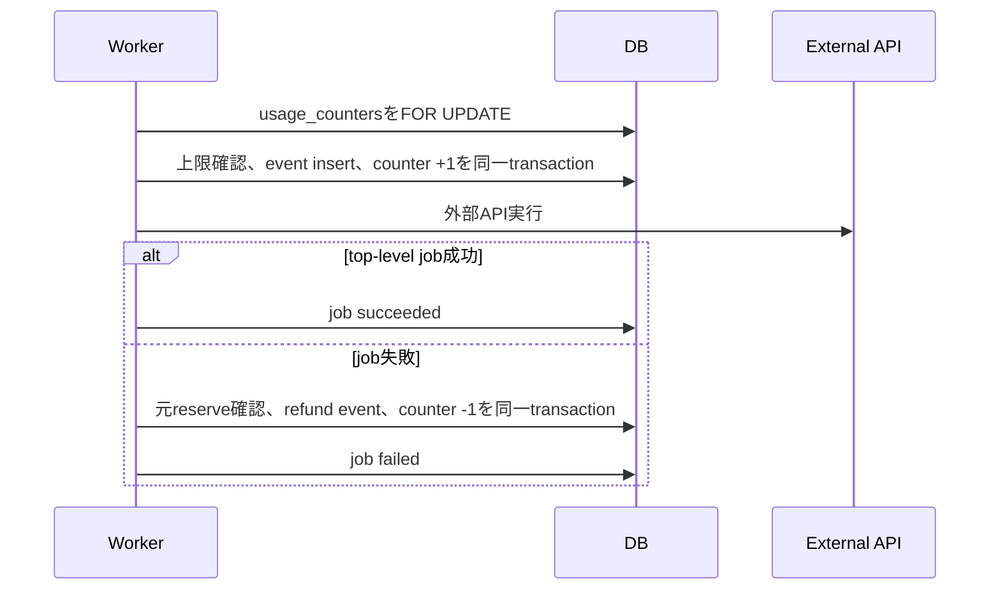

# 要件詳細 03: 認証・課金・利用枠

| 項目 | 内容 |
|---|---|
| バージョン | v1.35 |
| 更新日 | 2026-08-21 |
| 関連 | PRD A/O、SC-02〜04/SC-11 |

## 1. 認証

| 項目 | 仕様 |
|---|---|
| 登録 | Supabase Authのメール＋パスワード。確認メールを必須にする |
| ログイン | `signInWithPassword`成功後に欠損profileを補完し、`subscription_status=incomplete|incomplete_expired`は`/plans`、それ以外は安全な`next`または`/app`へ遷移する。`email_not_confirmed`は黄色の案内付き6桁コード画面へ切り替え、新しいTurnstile token取得後にコードを自動再送する |
| パスワード再設定 | `resetPasswordForEmail`は登録有無にかかわらず同じ受理応答を返す。recoveryリンクで確立したsessionと、user_idを束縛した15分TTLの改ざん検知HttpOnly cookieが一致するときだけ`updateUser`を許可し、成功後は両方を破棄する |
| パスワード | 8文字以上64文字以内かつUTF-8で72 bytes以下。ブラウザ・password managerの生成/貼り付けを妨げず、確認用入力と一致検証を行う |
| セッション | `@supabase/ssr`でリクエスト単位のServer clientを作り、proxyが`getUser()`でsessionを検証する。Server Components／Server Actions／API Routeの共通helperは同一リクエストへ引き継いだ検証済みuserを再利用し、proxyを通らない呼び出しだけ`getUser()`へフォールバックする。refreshはproxyで後段request cookieとブラウザ向けcookie／cache禁止headerへ反映し、session tokenをブラウザclientから直接扱わない |
| profile作成 | `auth.users`のAFTER INSERT trigger（`security definer`・空`search_path`）で作成。欠損時はsignup確認完了、ログイン成功、または認証済みで`/plans`へ入った時だけservice roleが`id`競合時DO NOTHINGの冪等insertを行い、既存値を更新しない。全画面共通認証helperでは毎回の存在確認をしない |
| ログアウト | Supabase sessionを破棄し`/login`へ遷移 |

認証エラーで秘密値、メールの存在有無、外部providerレスポンス本文をそのまま表示しない。

ログイン失敗はinvalid credentials、rate limit、provider障害を同じ汎用文言へまとめる。Supabaseの安定した`email_not_confirmed`コードだけは6桁コード入力状態として扱い、providerのmessage文字列では分岐しない。ログイン用Turnstile tokenは検証済みで1回限りのため再送へ使い回さず、切替後の`signup-resend` widgetが発行したtokenで`resend({type:'signup'})`を1回だけ自動実行する。自動再送後も手動再送を残し、失敗時の行き止まりを作らない。ログインの`next`は`/plans`、`/reset-password`、`/app`配下だけを許可し、外部URLや認証routeは破棄する（2026-08-19 [Supabase resend](https://supabase.com/docs/reference/javascript/auth-resend)と[Cloudflare Turnstile server-side validation](https://developers.cloudflare.com/turnstile/get-started/server-side-validation/)を確認）。

**確認メールは6桁コード方式**（T-M8-121）。テンプレートに `{{ .Token }}` を入れ、登録画面から離れずに入力させる（`verifySignUpCode` が `verifyOtp({email, token, type:'signup'})` で検証しcookie sessionを確立する）。**リンク方式をやめた理由**: メールクライアントのURL先読みで1回きりのトークンが使い切られる／スマホで開くと別ブラウザになる／リモートのテンプレートが既定のままだとリンクが必ず失敗する（2026-08-02・08-18に2回発生）。password resetは引き続きリンク方式で、カスタムテンプレートから`/auth/confirm?token_hash=...&type=recovery`へ送りServer側の`verifyOtp`でcookie sessionを確立する。成功後はtoken情報を残さずsignupを`/plans`、recoveryを`/reset-password`へ遷移させる。recovery成功時だけ`APP_ENCRYPTION_KEY`で封緘したuser_id・発行時刻をHttpOnly／SameSite=Lax／15分TTL cookieへ保存し、password更新時に現在sessionのuser_idとの一致とTTLを検証する。期限切れ・使用済み・不正token/コードまたはmarkerはprovider理由を出さない汎用エラーへまとめ（**コードは「違う」と「期限切れ」を断定せず、次にやることだけを示す**——Supabaseがどちらも同じ系統で返すため断定すると嘘になる）、signup確認は同じ画面の再送フォーム、recoveryは再申請導線を表示する。**入力コードは全角数字・空白・ハイフンを吸収してから検証する**（メールからのコピーで混ざるため。正しく写しているのに弾かれる形を作らない）。productionはSupabase Authのrate limit、Turnstile、Gmail custom SMTPを有効化する。Supabase Freeでは利用できない漏洩パスワード保護はPro移行後に有効化する。

会員登録時は現行の利用規約versionへの明示同意とプライバシーポリシー確認を必須にし、versionと時刻をprofileへ保存する。重大改定で再同意が必要な場合は、既存データ閲覧を許可したまま生成・投稿前に`legal_consent_required`（`details.missing=terms_consent|privacy_acknowledgement`、`settingsPath=/app/consent`）を返して同意画面を表示する。

`/app/consent`はprofileと現行versionを比較し、不一致の利用規約／プライバシーポリシーだけに独立した明示checkboxと新規タブの文書リンクを表示する。Server ActionはDBを再読込し、必要なcheckboxとクライアントversionの現行一致を確認してから、対象文書のversion／同意時刻だけを更新する。既に現行の文書は上書きせず、両方現行ならno-opで`/app`へ戻す。未同意・古いclient version・DB失敗時は更新しない。

共通実行ガード（`requireExecutionUserId`）は**法務同意を先に確認する**。契約状態は実行前提（`checkExecutionPrerequisites`）が別に判定するため、**解約済みで規約versionも古い利用者には`legal_consent_required`が先に出る**（T-M8-134 で導線を追加。同意画面へ進めば契約の案内へ到達できる）。route guardには規約versionを使わないため、古いversionでも既存データ閲覧と設定操作は継続できる。

現行versionは`src/lib/legal.ts`の定数（`CURRENT_TERMS_VERSION`／`CURRENT_PRIVACY_VERSION`）を正とする。**利用者に露出するため`-draft`のような内部向け接尾辞は付けない**（T-M8-72）。`signUp`はクライアント値がこのversionと一致する場合だけSupabase Authを呼び、profile作成後にservice roleで両versionと同一の受付時刻を保存する。providerの詳細エラーやメール存在有無は画面へ返さず、確認メール再送も存在有無にかかわらず同じ受理応答とする。

## 2. プラン

**リリース記念キャンペーン（T-M8-118・2026-08-17 運営者の指示）**: 表の金額は**実際に請求する額**で、Stripe Price と一致する。あわせて `PLANS[].regularPriceJpy`（請求額の2倍＝2,960／7,960／29,600円）を「キャンペーン終了後の価格」として画面に併記する。**「通常価格」とは表示しない**——景品表示法の二重価格表示は通常価格として示すなら実際にその価格で相当期間販売した実績が必要で、この3プランにその実績が無い。表示の分岐は `RELEASE_CAMPAIGN`（`src/lib/plans.ts`）が持ち、`active: false` にすると全画面から消える。終了手順（新Price作成→env差し替え→`monthlyPriceJpy` 更新）は同ファイルのコメントにある。

**解約時の追加割引**: カスタマーポータルの「顧客維持クーポン」で**50%オフ・3ヶ月**を提示する（適用後 740／1,990／7,400円）。**Stripeダッシュボードでのみ設定できる**（`billing_portal.Configuration` APIに該当フィールドが無い。当アプリのポータル設定は `is_default: true` なのでダッシュボードの設定が効く）。金額と根拠は `RETENTION_DISCOUNT` に記録する。**プレミアムはフル利用だと50%オフ後の額が原価を下回る**ため無期限にしない（原価はPRD §6.1）。


| プラン | 月額税込 | Xアカウント上限 | APIキー | 月間利用枠 |
|---|---:|---:|---|---|
| `standard`（スタンダード） | 1,480円（終了後 2,960円） | 1 | BYOK必須 | アプリ側上限なし |
| `premium`（プレミアム） | 3,980円（終了後 7,960円） | 1 | 不要 | AIクレジット1000、通常投稿200件、URL付き投稿20件 |
| `expert`（エキスパート） | 14,800円（終了後 29,600円） | 3（利用枠は合算） | 不要 | **画面表示は「無制限」**。内部ガードとしてAIクレジット5000、通常投稿1,000件、URL付き投稿100件（T-M8-168） |

**プラン再編（2026-08-20・T-M8-168・運営者の指示）**: 旧standard（500円・上限1・md編集不可）を撤廃し、旧mdを`standard`（スタンダード）へ改定、`expert`を新設した。DB enumも入れ替え済み（migration `20260820000003`。旧md行→standard、旧standard行→NULL＝未契約。本番は該当5件すべて未契約を実測確認済み）。**md/プロンプト編集は全プラン可**になった。

standardは利用者自身のX/AI契約へ原価が発生するため、アプリ側の月間投稿枠・生成枠を設けない。Xの自動化ルールと誤操作対策を目的とする1 Xアカウントあたり日次50ポストの安全上限は、課金主体にかかわらず全プランへ適用する。premium/expertは運営App・運営AIキーの原価管理のため月間利用枠も適用する。

**expertの利用枠は画面に出さない**（運営者の決定 2026-08-20。注記なしで「無制限」と表示する。景表法の優良誤認リスクは提示のうえの判断で、利用規約第3条に一時停止があり得る旨を記載する）。上限・残量の数値を**残量カード・バナー・通知・エラーdetailsのどこにも出さない**。到達時はエラーコード`usage_paused`（「連続的な使用が検知されたため一時的に停止しております。お待ちください。」）で、80%/100%の閾値通知も作らない（数値が漏れるため）。判定はコードの`concealsUsageLimits`（`src/lib/plans.ts`）が正本。

- **残量サマリはサーバー側で数値をゼロ埋めして返す**（`computeUsageSummary`）。設定画面はサマリをclient componentへ渡すため、UIで隠すだけではRSC（Flight）ペイロードのview-sourceに内部ガード値が載る。
- **停止表示（`paused`）は「残りが0」ではなく「AIクレジット残が1回分の見積もり（`TEXT_DEFAULT_ESTIMATE_CREDITS`）に満たない」時点で立てる。** 実行側（予約起票の`operatorBudgetOk`・`reserveUsage`）は残高が見積もりに満たない段階で止まるため、0まで表示を待つと「止まっているのに画面は何も言わない」期間ができる（expertは数値も閾値通知も無く、この表示が唯一の気付く経路）。バナー・残量カードは`summary.paused`だけを見る。

全プラン7日間無料トライアル。Checkoutでカード登録を必須とし、trialはuser_idごとに初回1回だけ付与する。

### 2.1 Checkout作成

- `POST /api/stripe/checkout`は`{"plan":"standard|premium|expert"}`だけを受け付け、未知フィールドも入力不正として拒否する。planをサーバー側の環境変数Price ID対応表で解決し、クライアントからPrice IDを受け取らない。
- Supabase sessionと`Origin === new URL(APP_BASE_URL).origin`を検証する。既存の`stripe_customer_id`を再利用し、未作成時はemailと`user_id` metadataを付け、`exos-ai:customer:{user_id}`を冪等keyとしてCustomerを作成してprofileへ保存する。
- Checkout Sessionはsubscription mode、カード登録必須、quantity 1とし、session／subscriptionのmetadataおよび`client_reference_id`へ本人user_idとplanを関連付ける。
- `trial_used_at is null`の場合だけ`subscription_data.trial_period_days=7`を設定する。trialing subscriptionの同期時に`trial_used_at`を初回値のまま保存し、解約・再契約でnullへ戻さない。
- success URLは`{APP_BASE_URL}/api/stripe/return?source=checkout&session_id={CHECKOUT_SESSION_ID}`、cancel URLは`{APP_BASE_URL}/plans?checkout=canceled`としてサーバーで固定生成する。復帰同期後は`/plans?checkout=success&sync=...`へredirectする。任意の外部return URLは受け取らない。
- プラン選択からCheckoutまでに、税込月額、7日trial、trial後の自動更新、支払時期、解約方法、提供開始時期を表示する。

### 2.2 Customer Portal作成

- `POST /api/stripe/portal`はSupabase sessionと`Origin === new URL(APP_BASE_URL).origin`を検証する。本人profileの`stripe_customer_id`だけを使い、Customer ID、Configuration ID、return URLをクライアントから受け取らない。
- **クライアントから受け取るのは `intent`（`update`／`cancel`）だけ**（2026-08-03 決定）。`update`はプラン変更、`cancel`は期間末解約のPortal画面へ`flow_data`で直接入る。「プランを管理」という1つのボタンだと押した先で何ができるのか分からないため、**やりたいことを画面で選ばせてから**該当画面へ送る。**`intent`が無い場合だけ**`flow_data`を付けずPortalのトップを開く。**`intent`があるのに対象の契約が見つからない場合は§6のとおり`subscription_required`で止める**（T-M8-56。黙ってトップを開くと「プランを変更」を押した先で何もできない）。完了後は`after_completion`で同じreturn URLへ戻す。
- 契約前（`stripe_customer_id`なし）はPortalを作れないため、**画面に押せないボタンを出さず**`/plans`へのリンクにする（要件06 §10）。**`/plans`側は「Stripeの顧客が紐づいている契約者」だけを`/app`へ送り返す**——顧客が未紐づけのまま送り返すと、「プランを選ぶ」を押してもホームへ戻るだけで何もできない（webhookの到着順で一時的に起こり得るうえ、同期が来なければ恒久的に詰まる）。同期の遅れは既存の一文（「変更内容はStripeからの通知を受けてこの画面へ反映されます」）が伝えるので、待ち状態の説明を別に足さない。
- Customer未作成は`subscription_required`、未認証は`unauthorized`、Origin不一致は`forbidden`、Stripe障害はprovider本文を隠した`provider_error`で拒否する。成功時は短寿命のHTTPS Portal Session URLだけを返す。
- **待っても直らないStripeの失敗は`provider_error`にしない**（T-M8-148）。アカウントが本番決済を受け付けられない状態（`cannot currently make live charges`）は`feature_disabled`へ分ける。`provider_error`の文言は「時間をおいて再度お試しください」で、この状態では嘘になり同じ操作を繰り返させる。画面は固定文ではなくサーバが返した文言を出す。運営者向けの原因表示は状態確認の「決済の受付（Stripeアカウント）」が担う（Priceの金額が一致していてもアカウントが未有効化なら申し込みは必ず失敗するため、既存の検査は全部緑のまま押した人だけが行き止まりになっていた）。
- Sessionの`configuration`は`STRIPE_PORTAL_CONFIGURATION_ID`（developmentだけ省略可）、return URLは`{APP_BASE_URL}/api/stripe/return?source=portal`でサーバー固定とする。復帰同期後は`/app/settings?tab=billing&portal=return&sync=...`へredirectする。
- `npm run stripe:portal:setup -- --dry-run`でConfiguration内容を通信なしで確認できる。実行時は**既存のconfigurationを上書き更新する**（新規作成はしない。IDが変わらないのでenvを触らずコードと設定を一致させられる）。**どの環境を設定するかは呼び出し側が明示し、構成IDは環境ごとに別の変数から読む**（既定へ落とさない。2026-08-04、既定でローカルの値を読んで**別環境を更新して「成功」と表示した**・T-M8-35）。適用後に読み戻して`subscription_update`／`subscription_cancel`が有効になったかを確認し、無効なままなら終了コード1で失敗する。秘密鍵は出力しない。手順とコマンドの正本は[デプロイ手順 §1.4](../operations/deployment.md)。
- **Portalの設定はコードに現れない**ため、状態確認（`npm run doctor` / `/api/cron/doctor`）で毎回読み取り、画面のボタンが依存する機能が有効かを判定する（無効なら error）。**設定IDがそのStripeアカウントに存在しない場合（`resource_missing`）は「別の環境の値が入っている可能性」として error にする**——`.env` に別環境の値が入る事故が実際に起きており（2026-08-05、同じ変数が2回定義され後の定義が勝っていた）、「確認できませんでした」では原因に辿り着けない。Stripeへ届かなかっただけの場合とは区別する。2026-08-03、この確認が無かったため「プランを変更」を押して初めて無効だと分かった。

### 2.3 Stripe画面への接続準備

Checkout／Customer Portalの全入口は、ボタン押下直後に遷移先origin（`https://checkout.stripe.com`／`https://billing.stripe.com`）へ`preconnect`し、アプリ側APIの認証・profile読込・Stripe Session作成とDNS／TCP／TLSの準備を並行する（T-M8-152）。Session URLを受け取ってから接続を始める待ちを減らすためで、同一origin APIやStripe APIの処理自体を省略するものではない。Stripe公式がPortal Sessionを短寿命・オンデマンド作成としているため、押下前のSession作成・Session URLのキャッシュ／再利用はしない（2026-08-19 [Customer Portal Session](https://docs.stripe.com/api/customer_portal/sessions)と[Create a Checkout Session](https://docs.stripe.com/api/checkout/sessions/create)を確認）。

## 3. Stripeを正とする項目

`profiles`は画面・認可用のprojectionであり、契約の正本はStripeとする。次の項目だけをwebhookで同期する。

**解約予定（`cancel_at_period_end`）は、Stripeの `cancel_at_period_end` と `cancel_at` の**どちらか**が立っていればtrueとして同期する**（T-M8-57）。トライアル中にPortalで解約すると、Stripeはbooleanではなく`cancel_at`（=trial_endの日時）だけを設定するため、booleanしか読まないと「解約したのに画面は解約予定なしのまま」になる（2026-08-05に実測）。

- `stripe_customer_id`
- `stripe_subscription_id`
- `plan`
- `subscription_status`
- `current_period_end`
- `cancel_at_period_end`
- `trial_ends_at`
- `trial_used_at`（trialingを初めて確認した時だけ設定し、以後保持）
- `subscription_event_created_at`

画面表示のたびにStripe APIを呼ばない。Checkout／Portal Session作成成功時だけ、user ID・`source=checkout|portal`・開始時刻をAES-256-GCMで改ざん検知した30分TTLの`HttpOnly`／`SameSite=Lax` cookieへ保存する。`GET /api/stripe/return`は認証済みuserとcookieのuser／sourceを照合し、次の規則で一度だけ復帰同期してcookieを削除する。

- `profiles.subscription_event_created_at >= cookie.issued_at`なら開始後のwebhookが反映済みと判断し、Stripe APIを呼ばない。
- 未反映ならSubscriptionを1回だけ取得し、webhookと同じPrice検証・profile特定・row lock・event時刻比較・trial保持を使ってtransaction適用する。PortalはprofileのSubscription IDを使う。CheckoutはSessionを取得し、`client_reference_id`とCustomerが本人profileに一致する場合だけSessionのSubscription IDを使う。
- 復帰marker欠落／期限切れ／user・source不一致、通常の`/plans`／`/app/settings`表示ではStripe APIを呼ばない。同期失敗時はprovider詳細を表示せず`sync=pending`で画面へ戻し、通常のwebhook再送へ復旧を委ねる。
- 復帰同期のprojection時刻は取得時のserver時刻とするため、その直後に遅着した古いwebhookで状態を戻さない。後続のより新しいeventは通常どおり反映する。

## 4. Webhook処理

`POST /api/stripe/webhook`はbodyをJSON化する前のraw textと`Stripe-Signature`、環境別の`STRIPE_WEBHOOK_SECRET`をStripe SDK `constructEvent`へ渡す。header欠落、署名不正、既定5分のtimestamp許容範囲外は、詳細を返さず400で拒否する。署名検証後の処理失敗はSentryへevent ID／type（未知Price時はPrice IDも）だけを記録して500を返し、Stripeの再送へ委ねる。

対象外の署名済みeventは副作用・`stripe_events`記録なしで200応答する。対象eventはPrice検証後、`insert ... on conflict (event_id) do nothing returning event_id`でtransaction内claimし、競合時は処理済みとして副作用なしの200を返す。claim後の業務更新も同じtransaction callback内で行い、例外時はevent記録ごとrollbackする。`checkout.session.completed`／subscription created・updatedはtransaction開始前にSubscriptionを再取得して現在状態と単一Priceを検証し、deletedだけはevent内の最終Subscriptionを`canceled`として使用する。invoice eventの再取得・同期は§4.1のinvoice処理で行う。

### 4.1 対象イベント

| Stripe event | 処理 |
|---|---|
| `checkout.session.completed` | customer/subscription IDを確認し、subscriptionを取得して全項目同期 |
| `customer.subscription.created` | subscriptionを再取得してupsert |
| `customer.subscription.updated` | subscriptionを再取得してplan/status/period/trial/cancel予定を同期 |
| `customer.subscription.deleted` | `canceled`として同期 |
| `invoice.payment_failed` | subscriptionを再取得して現在statusを同期し、課金通知を作成 |
| `invoice.paid` | subscriptionを再取得して支払い復旧を同期 |

Price IDからplanへの変換に未知の値が来た場合はprofileを更新せず、Sentryへ記録して非2xxを返す。`stripe_events`も記録せず、Stripeの再送で復旧できる状態にする。

invoice eventは現行Invoiceの`parent.subscription_details.subscription`からSubscription IDを解決する。subscription由来でない一回払いinvoiceはeventだけを処理済み記録し、profile・通知を変更しない。`invoice.payment_failed`／`invoice.paid`はいずれもSubscriptionを再取得して§4.2の全契約項目を同期する。payment failedはprofile更新後、eventと同じtransaction内で`billing:invoice:{invoice_id}:payment_failed`をdedupe keyとする課金通知を作る。同一invoiceの再試行で通知を増やさず、設定snapshot・attempt count・invoice／subscription ID・同期statusをpayloadへ保存する。課金通知のin-app／emailが両方OFFなら通知rowを作らないが、profileの停止statusを使う常設バナーは設定にかかわらず表示する。`invoice.paid`は通知を作らず、再取得したactive等の現在statusへ復旧する。

### 4.2 冪等性と順序

1. raw bodyで署名を検証する。
2. 対象subscriptionをStripe APIから再取得し、Price IDを検証する。deleted eventだけはevent objectの最終状態を使用する。
3. 短いDBトランザクション内で`stripe_events.event_id`をinsertする。競合したら処理済みとして2xxを返す。
4. Stripe event `created`が`profiles.subscription_event_created_at`より古い場合はprofile更新をskipし、新しいeventは再取得した最新状態を反映する。
5. profile更新とevent記録を同一transactionでcommitする。失敗時は両方rollbackし、Stripe再送を受けられるようにする。

イベントの到着順が前後しても古い契約状態で上書きしない。

同期値はSubscriptionの`customer`、`id`、`status`、`cancel_at_period_end`、`trial_end`、`trial_start`、metadata `user_id`と、単一Subscription ItemのPrice／`current_period_end`から作る。現行Stripe APIでは契約期間がitem単位のため、複数itemは未知Priceと同様に同期を拒否する。profileは既存`stripe_customer_id`、またはCustomer未保存時だけUUID形式のmetadata `user_id`で特定し、両者の不一致・複数／欠損profileはrollbackする。`plan`、`subscription_status`、`current_period_end`、`cancel_at_period_end`、`trial_ends_at`、Customer／Subscription ID、event時刻を更新する。statusを初めて`trialing`として同期するときだけ`trial_used_at`へ`trial_start`（欠落時event.created）を保存し、以後のactive・解約・再契約では上書き／null化しない。

profile rowをtransaction内でlockし、保存済み`subscription_event_created_at`よりevent.createdが古い場合はprofile更新だけをskipしてeventを処理済み記録する。同時到着でもlock取得後に再判定する。新しいeventは再取得済みの現在状態を反映するため、event payloadの古いsnapshotへ戻さない。

## 5. 契約状態とアクセス

| status | 閲覧 | 生成・投稿・自動実行 | 主導線 |
|---|---|---|---|
| `trialing` | 可 | 可 | trial終了日表示 |
| `active` | 可 | 可 | 通常 |
| `past_due` | 可 | 停止 | 支払い更新 |
| `unpaid` | 可 | 停止 | 支払い更新 |
| `paused` | 可 | 停止 | 支払い方法登録・再開 |
| `canceled` | 可 | 停止 | 新規Checkout |
| `incomplete` | 設定・プランのみ | 停止 | Checkout完了 |
| `incomplete_expired` | 設定・プランのみ | 停止 | 新規Checkout |

`past_due`等でも、ユーザーは既存下書き・履歴・分析・設定を閲覧できる。課金停止を理由にデータを自動削除しない。

route guardでは`incomplete`／`incomplete_expired`（およびprofile取得不能）を`/plans`へ送り、例外として`/app/settings?tab=billing`と`/app/settings?tab=support`だけを許可する。`trialing`／`active`／`past_due`／`unpaid`／`paused`／`canceled`は`/app`配下の閲覧を許可し、生成・投稿系の停止はServer Action側で行う。

8 statusの閲覧範囲、実行可否、主導線は1つの共通マッピングを正とし、route guard、login後遷移、生成・投稿・自動実行のmutationガード、課金バナーで共有する。実行を許可するのは`trialing`／`active`だけとする。それ以外は`subscription_required`を返し、`details.missing=[subscription]`、現在status、`details.settingsPath=/app/settings?tab=billing|/plans`を含める。

App Shellは`notification_config`を参照せず、`past_due`／`unpaid`／`paused`をヘッダー直下の常設警告として表示してCustomer Portalへ誘導する。Customer ID欠損時はCheckoutへfail closedする。`canceled`は新規Checkoutへ誘導し、`trialing`はJSTの`trial_ends_at`を常設情報として表示する。これらのstatusでも既存データ閲覧は維持する。

## 6. プラン変更

3つの月額Priceは**同一Productでなくてよい**（2026-08-03 修正）。Portalの`subscription_update.products`はProductごとの配列を受け取るため、`npm run stripe:portal:setup`がPriceをProductごとにまとめて列挙する。以前は「同一Product配下」を要求して例外で止まっており、そのため**`subscription_update`が無効なconfigurationが残ったまま**になっていた（画面の「プランを変更」がStripeに拒否される）。Customer Portalはプラン変更を有効にし、値下げを`decreasing_item_amount`条件で期間末予約、解約を期間末、trial中の変更を`continue_trial`に設定する。値上げは即時反映し、日割り請求を有効にする。

Checkout・Portalのセッションは**`locale: "ja"` を固定で指定**する（ブラウザ言語の推定に任せない・T-M8-58）。Stripe側の**商品名はアプリの表示名（スタンダードプラン／プレミアムプラン／エキスパートプラン）と同じにする**——Checkout・Portal・請求書にそのまま出るため、英語のままだと日本語のサービスの中でStripeの画面だけ英語になる。`stripe:portal:setup` が名前と**説明文**（プラン差の一言要約。Portalの「プランを変更」画面で商品名の下に表示され、説明が無いと名前と金額しか出ず選べない・T-M8-65）も揃え、対応表と`plans.ts`の一致は`portal-configuration.test.ts`が検査する。環境ごとに別のStripeアカウントなので、staging/productionには `--target` 付きの再実行で反映する。

「プランを変更」「解約する」は`flow_data`（`subscription_update`／`subscription_cancel`）でStripeの該当画面へ**直接**入る。対象のsubscriptionは`profiles.stripe_subscription_id`を正とし、**nullのときはStripeからその顧客の変更できる契約（active／trialing／past_due・新しい順）を引いて補う**（webhook同期前でも正しい画面に着くため・T-M8-56）。それでも見つからなければ**黙ってPortalのトップを開かず**`subscription_required`で止める——トップに着いても変更・解約はできず、押した人には何が起きたのか分からない（2026-08-05に利用者が実際に踏んだ）。

Portal Configurationは`subscription_update.proration_behavior=create_prorations`により即時変更を日割りし、`schedule_at_period_end.conditions=[decreasing_item_amount]`に該当する値下げだけを期間末予約へ切り替える。`subscription_cancel.mode=at_period_end`、`proration_behavior=none`、`trial_update_behavior=continue_trial`を固定し、請求履歴と支払方法更新も有効化する。

| 変更 | 仕様 |
|---|---|
| standard → premium/expert | Stripe反映後、AIは運営キーへ切替。BYOKキーは削除しない。BYOK Appで認可済みのXアカウントは`expired`にして運営Appでの再連携を要求 |
| premium/expert → standard | Stripe Customer Portalで期間末変更。反映後、AI/XのBYOK資格情報を要求し、managed Appで認可済みのXアカウントは`expired`にしてユーザーAppでの再連携を要求 |
| premium ⇄ expert | どちらも運営キー（managed）なので連携は不変。利用枠の上限だけが変わる |
| 遷移先の上限超過 | 遷移先プランの`xAccountLimit`（standard/premium=1・expert=3）を超えるactiveは、選択中→作成が古い順に残して超過分を`disabled`。データ・tokenは削除しない（T-M8-168で旧standard専用の「1件だけ残す」から汎用化） |
| 解約予定 | `cancel_at_period_end = true`でも期間終了までは現在プランを利用可 |

複数Xアカウントの無効化はwebhook同期後の同一処理で行う。再アップグレード時にユーザーが再有効化する。

planが変わったSubscription同期は、profileの課金projection更新と次の処理を同じtransactionでcommit／rollbackする。

1. BYOK→運営キー系はBYOK Xアカウントを`expired`、運営キー系→BYOKはmanaged Xアカウントを`expired`にする。token・BYOKキーは保持する（判定は`isOperatorManagedPlan`）。
2. 遷移先の`xAccountLimit`を超えるactiveがある場合、選択中→作成が古い順に上限まで残し、超過分を`disabled`にする。選択中が残らなければ残存の先頭へ付け替え、無ければ選択を解除する。
3. 運営キー系→BYOKは`ai_purpose_config`を登録済み`valid`キーと照合する。textはanthropic／openai／google、imageはopenai／googleだけを維持し、欠損・invalid・未対応providerを`null`へ戻す。外部疎通と再有効化はM2の設定操作で行う。

planが同一のstatus／期間更新では上記副作用を再実行しない。stale eventは課金projectionと同様にプラン変更副作用もskipする。下書き、投稿履歴、実績、アカウント.mdと履歴、学習source、token／key ciphertext、利用台帳は削除しない。

OAuth再連携で同じ`x_user_id`が返った場合は既存`x_accounts` rowのtoken、`auth_type`、scope、statusを置き換え、アカウント.md・下書き・実績は維持する。別のX userが返った場合は新規アカウントとして扱い、プラン上限を検証する。

## 7. プレミアム利用枠

### 7.1 上限と対象

| 枠 | 月間上限 | カウント単位 |
|---|---:|---|
| 通常投稿枠 | 200 | Xへ送る最終本文にHTTP(S) URLがない投稿の作成成功または対応するロールバック削除成功1件につき1 |
| URL付き投稿枠 | 20 | Xへ送る最終本文にHTTP(S) URLが1つ以上ある投稿の作成成功または対応するロールバック削除成功1件につき1 |
| **AIクレジット** | 1000 | 文章・画像のAI実行の**実費**（1クレジット=1円相当・T-M8-109） |

**AIクレジット（T-M8-109）**: 生成・画像の2枠を金額制の1本へ統合した。内部的に1クレジット=1円相当（円換算1ドル=160円・PRD §6.1。**UIに円換算は出さない**）。消費は回数ではなく実費ベース:
1. **reserve（開始時）**: モデル別の見積もり（正本=カタログ`estimateCredits`。1回あたりの想定実費〔円〕を実測と実費構造〔検索固定費＋モデル単価比例部〕から算出。おまかせは文章16・画像12）を押さえる。上限判定は「現在値＋見積もりが上限を超えるか」（ちょうど埋まる量は通す）
2. **settle（成功確定時）**: 実費（原価台帳と同じ推定原価×160円・切り上げ・最低1）で精算する。差分は追加consume／部分refundイベント（`job:{id}:{type}:settle`）。**追加消費は上限チェックしない**——既に発生した実費は拒否できない（上限1000を超えても計上する）
3. **refund（失敗確定時）**: 見積もり全額を返還する（従来どおり）

画像の実費はモデル別の1枚あたり概算単価（`pricing.ts` `IMAGE_FLAT_RATES_USD`）を使う（従来は原価null記録だった）。

ニュース共通基盤・毎朝の投稿分析（T-M8-94で枠対象外）は消費しない。内部retry、GEN-FIX、学習分析に続く同一job内MD-MERGEは追加消費しない（学習内mergeの実費は親jobの精算に含まれず数円過小になる既知の近似・md-merge.tsに明記）。ユーザーが明示的に再生成・再分析した場合は新しいjobとして消費する。

reserveはjob開始時に1回だけ行い、**返還は失敗が確定したときだけ**行う（worker終端＝`failJob`／stale終端＝`finalizeFailedJob`）。handlerは返還しない。retryable失敗でqueuedへ差し戻される間は予約を保持する: 冪等keyがjob単位（§7.3）のため、差し戻し前に返還すると次のattemptが再予約できず、retryで成功したjobの枠が計上されないまま終わる。

投稿種別はX APIへ送る直前の最終payloadで判定する。HTTPSへ正規化済みのURLが1つ以上あれば、URL数にかかわらず`post_url`を1消費する。P-5で別管理する`quote_url`も1ポスト目のpayloadへ合成してから判定する。ロールバック削除は対応する`post_create` eventのcounter typeを引き継ぐため、同じtweet_idの作成と削除成功は同じ枠を合計2消費する。

### 7.2 月境界

- monthはJST基準`YYYY-MM`。
- 生成・画像はreserve時点、投稿はtweet_id成功時点の月へ記録する。
- 月またぎのrefundは元reserveと同じmonthへ戻す。
- 3 Xアカウント分をuser_idで合算し、繰り越さない。月初reset jobは不要。

### 7.3 冪等key

| 操作 | `idempotency_key` |
|---|---|
| 生成reserve | `job:{job_id}:generation:reserve` |
| 生成refund | `job:{job_id}:generation:refund` |
| 画像reserve | `job:{job_id}:image:reserve` |
| 画像refund | `job:{job_id}:image:refund` |
| 投稿作成consume（全プラン） | `draft:{draft_id}:tweet:{tweet_id}:post:create` |
| ロールバック削除consume（全プラン） | `draft:{draft_id}:tweet:{tweet_id}:post:delete` |

同じkeyはno-op。refundは元reserveのevent IDを`ref_event_id`へ保存する。

### 7.4 更新手順



workerが失われてjobがstale確定（failed化）する場合は、`scheduler_tick`が同じ冪等keyでrefundを実施する（要件04 §4。二重返還は冪等keyで防止）。

投稿作成・ロールバック削除はreserveしない。X API成功後、同じDB transactionで全プランの`usage_events`へ、`counter_type=post_normal|post_url`と`operation=post_create|post_delete`のconsumeを作る。premiumだけ対応する`usage_counters.normal_posts_count`または`url_posts_count`も加算する。日次50件の安全上限は両種別の`post_create`だけを合算し、`post_delete`は月間投稿枠と監査にだけ使う。DB保存だけ失敗した場合はtweet_idとX上の状態をreconcileし、同じAPI操作を再送しない。

原価集計対象の外部API呼び出しごとのprovider、operation、数量、実行時単価、推定原価は`external_api_usage_events`へ冪等記録する。`usage_events`は利用枠、`external_api_usage_events`は原価・API利用量の正本とし、両者を混同しない。X media uploadはユーザー指定により費用を考慮しないため、原価台帳とサービス内利用枠から除外する。

premiumでN件のthreadを開始するには、最終payload列を通常/URL付きへ分類する。通常件数を`R`、URL付き件数を`U`、最後のポストを除くprefix内の各件数を`R_prefix`/`U_prefix`とし、通常枠に`max(R, 2 × R_prefix)`、URL枠に`max(U, 2 × U_prefix)`の残量を必須とする。全件成功と、最後の投稿で失敗して成功済みprefixを同じ枠でロールバック削除する場合の大きい方を確保するためである。同一userの`post_publish`は直列化し、確認後に別アカウントの投稿が残量を消費する競合を防ぐ。

### 7.5 失敗時

| ケース | 生成 | 画像 | 投稿 |
|---|---|---|---|
| 外部API呼び出し前の検証失敗 | 消費なし | 消費なし | 消費なし |
| AI呼び出しが最終失敗 | refund | 対象外 | 消費なし |
| 画像生成が最終失敗 | 生成は成功 | refund | 消費なし |
| 生成成功後にユーザーが下書きを破棄 | 返還なし | 返還なし | 未投稿なら消費なし |
| 手動/自動投稿の途中失敗・ロールバック削除 | 返還なし | 返還なし | 投稿成功分に加え、削除成功分を追加消費 |
| 投稿済みポストを後から削除 | 返還なし | 返還なし | 返還なし |

## 8. 残量表示と通知

premiumだけ`usage_counters`から当月残量をホームと設定へ表示する。**枠は3つ**（AIクレジット・通常投稿・URL付き投稿）で、回数制（`generations`／`images`）は T-M8-108/109 でAIクレジット制へ置き換えた。上限値の正本は`PLANS.premium.usageLimits`（`src/lib/plans.ts`）、形は`UsageSummary`（`src/lib/usage/usage-summary.ts`）。80%到達は各枠・各月で1回、100%到達は常設バナーと通知を出す。

```json
{
  "ai_credits": { "used": 220, "limit": 1000, "remaining": 780 },
  "normal_posts": { "used": 38, "limit": 200, "remaining": 162 },
  "url_posts": { "used": 8, "limit": 20, "remaining": 12 }
}
```

決済失敗、契約停止、利用枠100%は`notification_config`にかかわらず常設バナーを表示する。メール・通知一覧への作成は設定を尊重する。

## 9. 実装時の公式参照

- [Supabase `resetPasswordForEmail`](https://supabase.com/docs/reference/javascript/auth-resetpasswordforemail)：recoveryメール送信とredirect指定（2026-07-22確認）
- [Supabase password security](https://supabase.com/docs/guides/auth/password-security)：recovery後の`updateUser`によるpassword更新（2026-07-22確認）
- [Stripe Subscriptions overview](https://docs.stripe.com/billing/subscriptions/overview)：subscription statusとライフサイクル
- [Create a Checkout Session](https://docs.stripe.com/api/checkout/sessions/create?lang=node)：subscription mode、Price、Customer、metadata、success/cancel URL、trial設定（2026-07-22確認）
- [Retrieve a Checkout Session](https://docs.stripe.com/api/checkout/sessions/retrieve?lang=node)：復帰時のSubscription、Customer、client reference検証（2026-07-22確認）
- [Create a Customer](https://docs.stripe.com/api/customers/create?lang=node)：emailとmetadata（2026-07-22確認）
- [Idempotent requests](https://docs.stripe.com/api/idempotent_requests)：Customer作成の冪等key（2026-07-22確認）
- [Receive Stripe events](https://docs.stripe.com/webhooks?lang=node)：raw body署名検証、timestamp許容範囲、重複・非同期再送・順序非保証（2026-07-22確認）
- [Process undelivered events](https://docs.stripe.com/webhooks/process-undelivered-events)：処理済みevent再送のskip＋成功応答（2026-07-22確認）
- [Retrieve a subscription](https://docs.stripe.com/api/subscriptions/retrieve?lang=node)：Customer、status、trial、metadataとSubscription ItemのPrice／current period（2026-07-22確認）
- [Subscription webhooks](https://docs.stripe.com/billing/subscriptions/webhooks)：created／updated／deletedの契約ライフサイクル（2026-07-22確認）
- [Invoice object](https://docs.stripe.com/api/invoices/object?lang=node)：`parent.subscription_details.subscription`、attempt count、invoice status（2026-07-22確認）
- [Create a Portal Session](https://docs.stripe.com/api/customer_portal/sessions/create?lang=node)：Customer、Configuration、return URL、Session URL（2026-07-22確認）
- [Create a Portal Configuration](https://docs.stripe.com/api/customer_portal/configurations/create?lang=node)：日割り、期間末変更条件、trial／解約方針（2026-07-22確認）
- [Configure the customer portal](https://docs.stripe.com/customer-management/configure-portal)：同一Product間の期間末ダウングレードとSubscription Schedule（2026-07-22確認）

Stripe SDKは`stripe@22.3.2`、API versionは`2026-06-24.dahlia`へ固定した（2026-07-22）。Portal Configurationの実IDはStripeアカウント準備後に環境変数へ設定する。外部仕様は各実装タスク開始時に再確認する。

## 招待プログラム（T-M8-174）

**詳細仕様の正本は [招待プログラム 実装仕様書](../cp/invite_cp.md)**（運営者の指示 2026-08-21）。ここには課金との接点だけを書く。

- **帰属**: `/r/{code}` が30日Cookie（`exos_ref`・Last Click）→ 登録成功時に `affiliate_attributions` へ（1ユーザー1招待者・登録後変更不可・自己招待禁止。失敗しても登録は止めない）。
- **報酬はStripeの支払成功が正**: `invoice.paid` のwebhook（event claim transactionの中）で `recordCommissionForInvoice` が作る。実際に支払われた金額×作成時点のランク率（累計有料招待数で20〜40%・snapshot）。Trial中（0円）なし・初回課金から最大6ヶ月・`customer.subscription.deleted`（canceled）で期間終了（**再契約でも再開しない**）・`charge.refunded` で取消（**webhookの購読イベントに charge.refunded を追加する必要がある**）。
- **確定と振込**: 支払＋30日で `pending`→`payable`（scheduler_tick相乗り・1日1回）。月初のtickが前月締めのPayoutを作成（¥5,000以上＋口座登録済みのみ。手数料¥980は報酬と会計分離）。運営者は `npm run affiliate:payouts` で一覧→ `-- --show <id>` で口座全桁（復号）→ 振込後 `-- --paid <id>`。
- **口座**: 口座番号はAES-256-GCM暗号文のみ保存（要決定D-33）。画面は末尾4桁。
- 画面はSC-12（要件06）。DBは要件02 §3.22〜3.26。

## 変更履歴

| バージョン | 日付 | 内容 |
|---|---|---|
| v1.27 | 2026-08-18 | リリース記念キャンペーン（T-M8-118）と6桁コードのメール確認（T-M8-121）を反映。プラン表の月間枠を金額制のAIクレジットへ揃えた（回数制の記述が残っていた） |
| v1.28 | 2026-08-18 | 残量JSONを実装の3枠（AIクレジット・通常投稿・URL付き投稿）へ。同意versionの具体値を `src/lib/legal.ts` 参照へ寄せた（T-M8-144） |
| v1.29 | 2026-08-18 | 共通実行ガードの判定順序を実装に合わせた（法務同意が先）。Portalの「契約が見つからないとき」を §6 と揃えた（T-M8-144） |
| v1.30 | 2026-08-19 | Stripeアカウントが本番決済を受け付けられない状態を `feature_disabled` へ分けた（T-M8-148）。状態確認へ「決済の受付」を追加 |
| v1.31 | 2026-08-19 | Checkout／Portal Session作成中にStripe画面originへの接続準備を並行する仕様を追加（T-M8-152） |
| v1.32 | 2026-08-19 | 未確認ログインを6桁コード画面へ切り替え、新しいTurnstile tokenでコードを自動再送する仕様を追加（T-M8-153） |
| v1.33 | 2026-08-19 | proxyの検証済みuserを後段で再利用し、Auth／profileの正常系重複往復を画面表示から削除（T-M8-154） |
| v1.34 | 2026-08-20 | プラン再編（T-M8-168）: 3プランの価格・上限・遷移表を全面改定。expertの利用枠秘匿（無制限表示・usage_paused）とXアカウント上限1/1/3を追加 |
| v1.35 | 2026-08-21 | 招待プログラム（帰属・報酬・振込とStripe webhookの接点）を追加（T-M8-174） |
