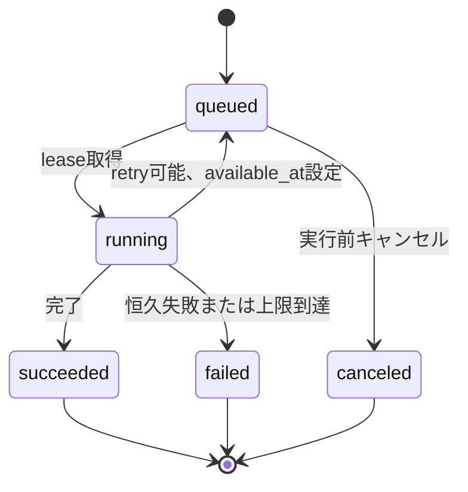
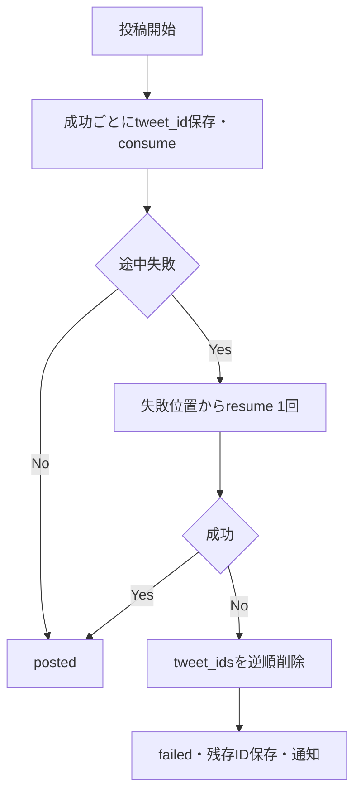

# 要件詳細 04: ジョブ・自動実行

| 項目 | 内容 |
|---|---|
| バージョン | v1.5 |
| 更新日 | 2026-07-24 |
| 関連 | PRD N/P/S/K/O、SC-05〜09、[ADR-0002](../decisions/0002-job-dispatch-fanout.md)、[ADR-0003](../decisions/0003-cron-window-claim.md) |

## 1. 実行モデル

- 長時間処理は`generation_jobs`へ先に永続化し、外部APIを呼ぶ。
- `kind`は実行内容、`trigger`は起点を表し、混同しない。
- すべてのjobは「1 job = 1 worker Function呼び出し」でdispatchする。worker（`POST /api/jobs/run`、`CRON_SECRET`認証）はjob IDを受け取り、認証・受領後すぐ202を返して本処理を`after()`で実行する。dispatch呼び出しは202受領までの軽量HTTPで、workerの処理完了を待たない。
- dispatch経路は3つ。(1) 手動操作: Server Action/API Routeがjob作成後、`after()`からworkerを呼ぶ。(2) 定時: `scheduler_tick`が到来スロットをenqueueした直後に各jobをdispatchする。(3) 子job: 親jobのworkerが子job（`parent_job_id`で紐付く画像生成・投稿実行）を本処理中に`queued`で作成し、**親jobがsucceededへ確定した直後に**、queuedの子jobをdispatchする。子は同一Xアカウント直列化（下記）により親running中はleaseできないため、作成直後ではなく親の成功確定後にdispatchする（dispatch失敗はqueuedのまま`scheduler_tick`が回収）。
- `scheduler_tick`は5分間隔（毎時00・05・…・55分）で起動する。**すべての起動が最初にenqueueクエリ（直前10分以内の未処理slotが対象）を実行する**。enqueueは`schedule_run_key`と`last_run_at`で冪等のため毎起動実行しても安全であり、定刻起動がlaunchd再試行込みで全滅しても、5分後・10分後のtickが§7.2の期限（+10分）内にenqueue・dispatchできる。初期はlaunchd、移行後はVercel Cron（`*/5`）から同じrouteを呼ぶ。
- `scheduler_tick`の回収は「tick内処理」ではなく「再dispatch」とする。dispatch失敗・stale解除で残ったqueued jobを`scheduled_for`昇順→`created_at`昇順で1起動最大50件dispatchする。tick内の処理順は「(1) 期限切れschedule起点jobのcancelと未enqueue slotの`schedule_missed`通知（§7.1/§7.2）→ (2) enqueue → (3) dispatch → (4) 通知メール・期限切れデータ回収」とし、+10分を過ぎたjobがdispatchされないようにする。
- 同一Xアカウントのjobと、同一userの`post_publish`は同時実行しない。workerはlease取得時にこの制約を検証し、取得できなければ何もせず終了する（jobはqueuedに残り、後続のdispatch・回収が拾う）。
- すべての外部API呼び出し前に契約、キー、X連携、利用枠を再検証する。
- `FEATURE_QUOTE_POST_ENABLED=false`の間はP-5のjobを実行しない。既存のqueued P-5 jobも外部API・利用枠を消費する前に`feature_disabled`でcanceledにする。
- `learning_analysis`と`md_merge`はXアカウント単位で直列実行し、base_md更新時に開始時versionが変わっていないことを確認する。競合時は最新versionからmergeをやり直すかretryableとしてqueuedへ戻す。

## 2. Jobの対応

| `kind` | 主な実行ID | 結果 |
|---|---|---|
| `post_generation` | GEN-P1〜P6、内部GEN-FIX | draft |
| `image_generation` | GEN-IMG | draft.images更新 |
| `post_publish` | X投稿・thread | draft status/tweet_ids |
| `learning_analysis` | LRN-1〜3、同一job内MD-MERGE | learning source/base_md version |
| `md_merge` | 学習ソース削除時MD-MERGE | base_md version |
| `suggestion` | SUGGEST | improvement suggestions |

NEWSは全ユーザー共通の定時処理であり、ユーザー所有の`generation_jobs`へは保存しない。実行結果はSentry/logと`news_items.fetched_at`で追跡する。

## 3. 状態遷移

ユーザー再試行は元jobを変更せず、`parent_job_id`を持つ新しいjobを作る。履歴と利用枠イベントを追跡可能にするためである。

ユーザー操作は画面でUUIDの`request_key`を生成し、再送時も同じ値を使う。同じkeyが存在する場合は既存job IDを返す。子jobは`parent:{parent_job_id}:{kind}:{draft_id}`の決定的keyを使い、worker再実行で重複作成しない。

## 4. Leaseと回収

workerはdispatchで指定されたjob 1件を対象に、短いDB transactionで次を行う。

1. `pg_advisory_xact_lock`で対象`x_account_id`のロックを取得する。`post_publish`はさらに`user_id + ':post_publish'`のロックも取得する。job行のロックだけでは2つのworkerが互いの未commitのrunning遷移を見えず同時にlease成立し得る（write-skew）ため、直列化はadvisory lockで強制する。
2. 対象jobを`FOR UPDATE SKIP LOCKED`で取得し、`status = queued`かつ`available_at <= now()`であることを確認する。schedule起点の`post_generation`は`scheduled_for + 10分`以内であることも確認する（超過はcanceledにして`schedule_missed`通知を作る）。
3. 同時実行制約（同一Xアカウントのrunning job、同一userのrunning `post_publish`）を検証する。いずれかを満たさなければ何もせずcommitして202で終了する（jobはqueuedに残り、後続が拾う）。
4. `running`、`locked_at = now()`、`locked_by`、`attempt + 1`へ更新してcommitする（advisory lockはtransaction終了で自動解放される）。
5. 外部処理中は30秒ごと、またはstage変更時に`locked_at`をheartbeat更新する。
6. `locked_at < now() - 10 minutes`のrunning jobはstaleとする。`attempt < 3`ならlockを解除してqueuedへ戻し、`attempt >= 3`ならfailedへ確定する。failed確定と同一transactionで、当該jobの未返還reserve（`job:{job_id}:generation:refund`／`image:refund`の冪等key）をrefundする（通常経路のrefundと二重返還しない。要件03 §7.3）。

stale起因のfailed確定は`scheduler_tick`が行うため、workerの失敗経路と同一の終端処理もtickが実行する: `image_generation`はdraftを画像なし＋警告(failed印)で確定して後続へ進める（draft modeは`draft_created`通知／auto modeは`post_publish`作成。本文は使えるため`error`通知は作らない。auto modeの判定は親`post_generation` jobの`input.mode`から解決する）。`post_publish`はdraftを`failed`へ戻し`last_post_error`を保存する（`posting`のまま放置しない）。`md_merge`はsourceを`analyzed`へ戻して削除未完了を通知する。`image_generation`を除く各kind（`post_generation`／`post_publish`／`md_merge`）で`error`通知（dedupe_key `job:{id}:failed`）を作成する。この終端処理は`finalizeFailedJob`（`lib/jobs/terminal.ts`）に集約し、reserveのrefund（元reserve行から`counter_type`/`month`を引き継ぎ、`ref_event_id`へ元reserveを記録して`usage_counters`を-1）とkind別のdraft/source後始末を同一transactionで冪等に行う。reserve自体の作成はM6のため現状のrefundは実質no-op（先行配線）。workerの失敗経路との完全共通化はD-5（runJob中央finalizer）で行う。

外部API成功後にworkerが落ちる可能性がある処理は、provider request ID、draft、tweet_idなどの外部結果を先に保存し、再取得時にreconcileしてから再送可否を決める。

## 5. Retryとtimeout

| 対象 | 自動retry | 最終処理 |
|---|---:|---|
| AI 429, 5xx, network | 最大2回、指数backoff+jitter | failed |
| X read/media upload 429, 5xx, network | 最大2回、指数backoff+jitter | failed |
| X post作成の結果不明 | 自動再送しない。自分の直近投稿から照合 | 一意に確定できなければfailed＋手動確認 |
| X post削除の結果不明 | 対象IDを再取得して存在確認 | 削除済みなら成功扱い、判定不能はfailed |
| AI/X 401, 403 | なし | key/token失効、通知 |
| JSON parse | 同一top-level job内で再生成1回 | failed |
| 文字数超過 | 超過ポストだけGEN-FIX最大2回 | 警告付きdraft |
| Stripe webhook | アプリ内retryなし | 非2xxでStripe再送 |

`attempt >= 3`は自動取得しない。provider内部retryは`attempt`ではなく`usage.calls`に記録する。

Function開始から180秒を処理deadlineとする（maxDuration 200秒）。JSON修復や`pause_turn`継続など追加provider callは、残り時間が30秒未満なら開始せずretryableとしてqueuedへ戻す。各callのtimeoutは90秒とdeadlineまでの残り時間の短い方にする（初回call 90秒＋修復call 90秒が1 attemptに収まる）。

| 処理 | Function上限 | job内の目安 |
|---|---:|---:|
| 投稿生成・学習・提案 | 200秒 | 90秒（修復込み最大180秒） |
| 画像生成 | 200秒 | 90秒 |
| 投稿実行 | 200秒 | 60秒 |
| NEWS 1分野 | 200秒 | 90秒 |

## 6. 定時トリガー4本

| job | 初期launchd（JST） | Vercel Cron移行後（UTC） | 内容 | 1起動上限 |
|---|---|---|---|---:|
| `news_fetch` | 09:00〜20:00毎時 | `0 0-11 * * *` | 6分野を直近3時間ラップ取得（9〜11時は夜間・終了間際補完15/16/17h）、重複排除、時間単位ダイジェスト作成 | 6分野 |
| `scheduler_tick` | 5分間隔 | `*/5 * * * *` | due slot enqueue＋dispatch、queued/stale jobの再dispatch、期限切れschedule jobのcancel、通知メール・期限切れデータ回収 | enqueue 500、dispatch 50、cancel 500、email 100、DB cleanup各500、Storage cleanup 100 |
| `metrics_collector` | 毎時00分 | `0 * * * *` | dueなtweet_id別checkpoint更新 | 50 accountかつ500 tweet_idまで |
| `follower_snapshot` | 毎時10分 | `10 * * * *` | JST当日分がないactive Xアカウントを日次保存 | 100 accountまで |

スロットの設定時刻は09:00〜22:00の00/30分に限定し、定刻の`scheduler_tick`が到来スロットを即座にenqueue・dispatchする（正常系のleaseは定刻から数十秒以内）。transport失敗はlaunchd呼び出し側で30秒、60秒後に最大2回再試行する。定刻起動が3回すべて失敗しても、5分後・10分後のtickが未処理スロットを回収するため、§7.2の期限（+10分）内に通常2回の追加機会がある。

`news_fetch`は6分野を最大3並列で実行し、分野ごとに成功結果をcommitする。一部分野の失敗で他分野をrollbackせず、失敗分野は既存ニュースを保持してSentryへ記録する。全分野の処理がsettleした後、成功分野で新規保存されたニュースを対象に時間単位ダイジェストを作る。metrics/followerはdue対象だけを処理し、1回の上限を超えた残りは次の毎時起動へ委ねる。

metricsはXアカウントごとにtweet_idを最大100件へまとめ、異なるuser tokenを同じrequestへ混ぜない。metrics/followerの外部requestは最大10並列とし、Function deadlineで未開始分を次回へ残す。

launchdのHTTP再試行、切り替え時の二重起動、Vercel Cronの重複・並行起動に備え、各handlerは`job名 + 対象時刻窓`の受付（window claim）を最初に確保し、確保できなければ処理済み相当の2xxを返す。受付は`cron_runs`テーブル（`unique (job_name, window_key)`）へ`insert ... on conflict do nothing`する方式で、行を確保できた起動だけが本処理へ進む。Supavisor transaction modeプーラではセッションscope advisory lockがcheckout間で保持されずハンドラ全体をまたげないため、advisory lockは用いない（要件01 §3.2/§6、ADR-0003）。一度受け付けた時間窓は完了後も再受付しない（HTTP再試行・重複Cron起動での二重実行を防ぐ）。`news_fetch`は分野単位にも冪等keyを持ち、同じ時間窓のAIリサーチを重複実行しない。Vercel Cron移行後も呼び出し自体の再試行をVercelへ依存しない。

`cron_runs`の責務は重複受付防止のみで、本処理の成否・完了は持たない。**受付（cron claim）と業務処理の完了は別状態**であり、`cron_runs`の行だけで本体成功を判断しない。完了状態の正本は、永続ジョブは`generation_jobs.status`/`finished_at`、状態ベースcron（`scheduler_tick`/`metrics_collector`/`follower_snapshot`）は対象業務データの現在状態とする（`cron_runs`の保持・cleanupは要件02 §3.18・要件01 §9）。

実行保証:
- Cronトリガー: `(job_name, window_key)`単位で**at-most-once**（同一窓の受付は高々一度）。
- `generation_jobs`: retry（`attempt`上限3・指数backoff）とstale回収・scheduler再dispatchによる**at-least-once相当**。
- 状態ベースcron: 同一窓は再実行せず、**次窓で現在状態を再走査してcatch-up**する（tickはqueued/staleを毎回回収、metrics/followerはdue対象を毎回処理）。失敗・中断した窓の未処理は次窓が回収する。
- 副作用は冪等キーまたはDB制約（unique）で重複に耐える。
- 本システムのどの経路も**exactly-onceは保証しない**。

`news_fetch`は時間窓の欠落を許容しないが、NEWSは§2のとおり`generation_jobs`を用いず`news_items.fetched_at`で追跡する。そこで**各回が直近3時間分を重ねて取得**し（プロンプト設計書 §6.10の`{{hours}}`＝12:00〜20:00は3、当日9:00/10:00/11:00は前日18:00以降を補うため15/16/17。20:00始点だと稼働終了直前の19時台発行分が1回しか取得機会を得ず欠落し得るため18:00始点とする）、一部の起動が失敗しても**3回に1回成功すれば**当該時間帯を取得できる設計とする（D-3の解決。ADR-0003）。窓の重なりによる重複は`source_url`のcanonical unique制約と`<known_urls>`で排除するため、`cron_runs`の受付は並行・重複起動の抑止のみを担い、欠落回復はラップ取得側が持つ（NEWSを`generation_jobs`化する案は不採用）。

## 7. スロットenqueue

### 7.1 条件

- `schedule_slots.enabled = true`
- 現在JSTの曜日・時刻がslotと一致する。tick遅延を考慮して直前10分以内の未処理slotを対象にする
- profileが`trialing`または`active`
- X accountが`active`
- `mode=auto`はXアカウントに現行versionの自動投稿同意があり、`automation_disabled_at is null`
- BYOKは必要なX/AI keyが`valid`
- premiumは生成枠、画像ONなら画像枠、autoなら通常投稿枠とURL付き投稿枠の両方にパターン別最大数から算出したロールバック安全残量がある
- 当日JSTの`usage_events`にある同一Xアカウントの`operation=post_create`件数が、パターン別最大数を足して50以下
- P-5はスケジュール対象外

スケジュールenqueue時は、出典を付けるP-1/P-3/P-4/P-6を「最終1件がURL付き、先行ポストは通常」と保守的に仮定する。最大数に対する必要残量はP-1=通常10＋URL1、P-2=通常1＋URL0、P-3=通常12＋URL1、P-4=通常8＋URL1、P-6=通常12＋URL1。生成後の投稿直前には実際にXへ送る各payloadで再分類し、通常/URL付き枠を別々に再判定する。

定刻から10分を超えた未実行slot（enqueueされないままのslotを含む）は遡って自動投稿しない。`scheduler_tick`が回収ステップで`schedule_missed`のerror通知を作り（冪等key `slot:{slot_id}:{yyyy-mm-dd}:{hh:mm}:missed`）、次回定刻を待つ。

### 7.2 冪等性

`schedule_run_key = slot:{slot_id}:{yyyy-mm-dd}:{hh:mm}`をjobのunique列へ保存する。enqueueと`last_run_at`更新を同一transactionで行い、同じ定時実行を二重作成しない。

予定時刻は`scheduled_for`へUTCでも保存する。schedule起点の`post_generation`が`scheduled_for + 10 minutes`までにleaseを取得できなければ、外部APIと利用枠を消費せずcanceledにして`schedule_missed`通知を作る。正常系ではtickがenqueue直後に各jobをdispatchするため、leaseは定刻から数十秒以内に取得される。この期限切れcancelは`scheduler_tick`が回収時に実施し（1起動500件まで）、通知は同一Xアカウント×同一時間窓で1件に`dedupe_key`で集約する。

## 8. 投稿生成

1. job lease取得、契約・key・利用枠を検証する。
2. premiumは生成枠をreserveする。
3. `validating`→`research`→`writing`とstage更新する。
4. AI出力をJSON、ポスト数、加重文字数、NG、出典で検証する。
5. draftを作成する。ニュース起点は`source_news_item_id`を保存する。
6. 画像OFFならdraftを確定する。draft modeは通知、auto modeは阻害警告がなければ`post_publish`子jobを作る。
7. 画像ONなら`image_generation`子jobを作り、本文生成jobは`succeeded`にする。画像子jobが成功または最終失敗した時点でdraftを確定し、draft modeの通知またはauto modeの`post_publish`作成へ進む。
8. 親workerは子jobを作成し、**自身のjobを終端状態（succeeded/failed）へcommitしてから**子jobをdispatchする（同一Xアカウント直列制約により、親がrunningのままでは子がleaseできないため。画像workerが`post_publish`を作る場合も同じ順序）。同一Function内で子jobの本処理は行わない。dispatch失敗時はqueuedのまま残り、次の`scheduler_tick`（最大5分後）が回収する。

この連鎖により「生成→画像→投稿」の各段は独立したFunctionで実行され、段間の遅延はdispatch往復の数秒のみとなる。画像ONのautoスロットでも投稿は定刻から概ね5分以内、dispatch失敗が挟まっても10分程度で完了する。

画像失敗は本文生成jobをfailedにしない。画像子jobをfailed、draftを画像なし＋警告にし、自動投稿は本文だけ継続できる。

## 9. 画像生成

`image_generation`は画像ONの`post_generation`成功後に連鎖起動される子job（§1(3)）。親workerが決定的 request_key `parent:{parent_job_id}:image_generation:{draft_id}`＋on conflictで作成するため、worker再実行時も子jobは重複作成されない。

1. premiumは画像枠をreserveする。
2. PT-IMG（ベースmdセクション3＋1ポスト目本文）でprompt作成後、画像providerを呼ぶ。
3. JPG/PNG/WEBP・5MB以下へ正規化する。
4. private Storageへ保存し、`drafts.images`（`storage_path`・`status`等）を更新する。
5. 最終失敗は画像枠をrefundし、警告と再生成操作を残す。

Storage upload失敗も画像job失敗としてrefundする。X media uploadは画像生成枠と無関係で、投稿job内で行う。

`draft_created`通知の送信主体: 画像ON時は本文確定後に画像job（成功・失敗いずれも）が送る（画像OFFは`post_generation`が送る）。画像/Storage/PT-IMGの最終失敗時は本文を画像なしで確定し、`drafts.images`へ`status=failed`の印を残して`draft_created`を送り、子jobは`failed`にする（本文生成jobは失敗させない）。画像枠のreserve/refund（1・5）はM6で実装する。

画像再生成は既存画像を残したまま新規生成し、新画像のStorage保存とdraft参照の切替が成功してから旧objectをbest effortで削除する。再生成失敗時は既存画像を維持する。

## 10. 投稿実行

1. draftをlockし、`draft`または再試行可能な`failed`を`posting`へ変更する。
2. 契約、X token、日次上限、premiumの通常/URL付き投稿残量、thread、警告を検証する。auto起点の`post_publish`はこの時点でも現行versionの自動投稿同意と未撤回を再検証する。残量は要件03 §7.4の通常/URL付き別ロールバック安全量を必須とし、同一userの他の投稿jobがrunningなら処理しない。
3. P-5は`quote_tweet_id`で対象ポストを再取得し、取得成功後に正規化済み`quote_url`を1ポスト目の本文末尾へ合成する。対象取得不能、URL不正、合成後の加重文字数超過はX APIを呼ばず失敗にする。
4. 画像があればX media uploadを完了し、media idを得る。失敗時は本文を投稿しない。
5. 1ポスト目を通常投稿として送信する。P-5も`quote_tweet_id`は指定せず、対象URLを含む本文を使う。画像ありは`media_ids`を指定する。
6. 後続は直前の自分のtweet_idへのreplyとして投稿する。
7. 各成功直後にtweet_idを保存し、全プランで`post_create` consume eventを作る。premiumだけ月次counterを同一transactionで加算する。
8. 全件成功でdraft rowを削除せず、`status=posted`、`root_tweet_id`、`posted_at`、`posted_mode`を更新する。rowは下書き一覧から外れ、投稿履歴とtweet_id別実績の正本になる。

原価集計対象のX/AI外部呼び出しは成功・失敗を問わず、返却されたrequest ID、resource数、token/search usage、実行時単価、推定原価を`external_api_usage_events`へ冪等保存する。provider本文、投稿本文、prompt、tokenは保存しない。X media uploadは運用logだけへ記録し、原価台帳から除外する。X単価は環境変数`X_COST_*`のsnapshotを採用し、投稿作成は本文のURL有無で通常/URL付き単価を分ける。読取（`x_post_read`/`x_user_read`）は課金単価を持たないため単価0で記録する。`dry_run`は実外部呼び出し（実原価）が発生しないため原価台帳（`external_api_usage_events`）には記録しない。失敗時は resource 未作成のため推定原価0で記録する。

post作成でtimeout、接続切断、5xx等により作成成否が不明な場合は同じ本文を再送しない。対象アカウントの直近投稿を取得し、本文、作成時刻、reply先、quote先が一致する候補が1件だけならそのtweet_idを保存して継続する。候補なし・複数は`post_state_unknown`でfailedにし、X上の確認を促す。

`X_POSTING_MODE = dry_run`では投稿・削除・media uploadのX API書き込みを行わず、擬似tweet_idをUIへ返す。ただし投稿workerの記帳（`tweet_ids`保存・全プランの`post_create` consume event・`status=posted`/`root_tweet_id`/`posted_at`/`next_metrics_at`更新・posted通知）は、dev/preview（dry_run必須, 要件01 §3.1）でも投稿フローと日次上限を検証できるよう実行する。原価台帳（`external_api_usage_events`）への記録とpremium月次counter（`usage_counters`, M6）の加算は行わない。実績取得（`/2/users/me`・tweet読取）はmodeに依らず実行する。

## 11. スレッド途中失敗

同一投稿job内では保存済み`tweet_ids.length`を再開位置とし、失敗位置から1回だけ再開する。

- rollback削除にもX APIのretry方針を適用する。削除成功ごとに全プランで`post_delete` consume eventを作り、premiumは月次投稿counterをさらに1加算する。
- 削除成功後も`tweet_ids`は監査用に保持する。`last_post_error.deleted_tweet_ids`へ削除確認済みID、`remaining_tweet_ids`へX上に残るIDを保存する。
- premiumの通常/URL付き投稿枠は投稿成功分を返還せず、削除成功分も元投稿と同じ枠へ追加消費する。作成後にロールバック削除できたtweet_idは同じ枠を合計2消費、削除失敗は追加消費なしとする。投稿前の安全残量確認により、削除が各投稿枠上限で妨げられないようにする。
- 自動投稿でも手動投稿でも同じ規則を適用する。
- 1件でもtweet_idを作成したfailed draftは直接再投稿しない。曖昧状態と残存IDが解消済みなら本文・画像・引用情報を新しいdraftへ複製し、`parent_draft_id`で元draftへ結び付け、空の投稿状態から再開する。複製にはAIを使わず生成枠も消費しない。

## 12. 学習・改善

- LRN-1〜3はsource単位の`learning_analysis` job。参考アカウントは直近20件、参考投稿は対象1件、自己投稿は直近100件を取得し、分析結果保存後に同じtop-level job内でMD-MERGEする。mergeには対象セクションの現在値と、同セクションへ反映する全active sourceのanalysisを渡す。
- 適用済み学習sourceの削除はstatusを`removing`にして単独`md_merge` jobを作り、premium生成枠を1消費する。削除対象のanalysisと、残る全active sourceのanalysisから対象セクションを再構築し、削除sourceだけに由来する知見を残さない。merge成功時にbase_md新version作成とsourceの`removed`化を同一transactionで確定する。
- `removing`中は古い知見での生成を避けるため対象Xアカウントの新規生成を停止する。merge最終失敗時はsourceを`analyzed`へ戻して削除未完了を通知する。未適用のpending/failed sourceはAIを呼ばず直接removedにする。
- SUGGESTはユーザー操作だけで起動し、同一JST日かつ新しいmetrics更新がなければ拒否する。比較は同じcheckpoint同士に限定し、7日値を優先、比較グループが3件未満なら1日値を使い、異なる経過日数を混ぜない。
- 提案は最大2件で、表示専用とする。ベースmd・プロンプトへの自動反映は行わず、ユーザーが発信設定やmd編集（md/プレミアム）で自ら反映する。テーマ軸の分析はSUGGESTプロンプトが対象投稿の本文から判断する（テーマの事前集計・専用カラムは持たない）。

## 13. メトリクス・フォロワー

- `metrics_collector`は`status=posted`の全tweet_idに加え、`status=failed`で`last_post_error.remaining_tweet_ids`に残るIDを対象にする。投稿後1日・7日・30日表示用checkpointが未取得のIDから最大100件ずつ取得し、1 tweet_idあたりMVPでは最大3回読む。rollback削除確認済みIDは対象外とする。
- public metricsと、所有ポストで取得可能なnon-public metricsを要求する。取得不能fieldはnullを保持する。
- 取得値はtweet_id配下の`1`/`7`/`30` checkpointへ別々に保存し、後の取得で過去checkpointを上書きしない。
- 投稿完了時、または部分失敗でX上の残存IDが確定した時に`next_metrics_at`を1日checkpointへ設定し、各回の完了後に次のdueへ進める。対象tweet_idがすべて30日取得済みまたはunavailableなら`metrics_completed_at`を設定して回収対象から外す。
- checkpoint日数（1/7/30）の基準時刻は`drafts.posted_at`とする。`posted_at`は投稿成功時（投稿時刻）に加え、部分失敗でX上に残存IDが確定した時にも設定する（残存確定時刻。post_publishが両経路で設定し、metrics_collectorのアンカーとする）。アンカーを持たない行（`posted_at is null`）は収集対象にしない。
- 収集対象IDが無くなったdue draft（全ID取得済み、または`ambiguous_delete_tweet_ids`のみでremaining空 等）も`next_metrics_at`だけ前進させてdue窓から外す（同一行の無限再選定を防ぐ）。
- 1起動あたり50 account・500 tweet_id・外部request最大10並列を上限とし、Function deadline超過分は次回毎時起動へ委ねる。1アカウントのtoken取得失敗（失効）や読取失敗（401/403/429枯渇/5xx）はそのaccount/draft単位で隔離してスキップし、run全体を落とさない（失効はaccountスキップ、一時失敗は`next_metrics_at`据え置きで次窓が再走査）。
- 30日表示用checkpointはnon-public metricsの取得期限を越えないよう投稿後29日〜30日未満で取得する。期限内の取得に失敗したprivate fieldはnullのまま確定し、public metricsもMVPでは更新終了する。
- X上で削除済み・取得不能と確定したtweet_idは`unavailable`として以後のcheckpoint対象から外し、他のtweet_idの実績は継続する。
- `follower_snapshot`は`x_account_id + JST日付`でupsertする。

## 14. 通知

| event | type | dedupe key例 | link |
|---|---|---|---|
| 下書き作成 | `draft_created` | `draft:{id}:created` | `/app/posts?tab=drafts&draftId=...` |
| 自動投稿完了 | `posted` | `draft:{id}:posted` | `/app/posts?tab=history&draftId=...` |
| job失敗 | `error` | `job:{id}:failed` | 対象画面 |
| 時間単位ニュースダイジェスト | `news` | `news-digest:{window_started_at}` | `/app/news?from=...&to=...` |
| X/key失効 | `error` | 対象ID＋失効時刻 | `/app/settings` |

通知row作成時に設定をsnapshotし、メールONなら`queued`にする。送信成功は`sent`、最終失敗は`failed`とし、秘密値を含まない要約だけ保存する。

- ニュースは個別通知しない。JSTの取得時刻を起点とする1時間窓ごとに、`news_config.categories`と`impact_filter`へ一致する新着をユーザー単位で集約する。複数分野を1件へまとめ、該当0件なら通知rowを作らない。
- ダイジェストは`subscription_status in (trialing, active)`かつニュース通知のいずれかのchannelがONのユーザーだけへ、一括`insert ... select`相当でfan-outする。`user_id + dedupe_key`で再実行を冪等化し、両channelがOFFならrowを作らない。
- タイトル・本文には高impact、同一impactなら新しい順で最大5件を掲載し、全件数と一覧リンクを付ける。対象IDは`news_config.max_items`（1〜100、既定20）まで、時間窓とともに`payload`へ保存する。
- 一部分野が失敗した時間帯は成功分野だけでダイジェストを作り、失敗そのものを利用者へニュース通知として送らない。運営監視へ記録し、次回取得を継続する。
- notification commit後に`after()`でメール送信を起動し、残ったqueuedメールは`scheduler_tick`（5分間隔）が最大100件、最大10並列で回収する。最古のqueuedメールが10分を超えた場合はSentryへ警告する。
- provider送信は`notification:{id}`を冪等keyにし、429/5xx/networkは最大3 attempt、指数backoffで再送する。401/403または3回失敗は`failed`にする。
- アプリ内一覧は`in_app_enabled = true`だけを返す。メールだけ有効なrowも送信台帳として保持する。
- `scheduler_tick`のcleanupは40日を過ぎた`news`通知を先に削除し、その後に参照されない40日超の`news_items`を各500件まで削除する。`external_api_usage_events`の40日超の明細も1起動500件まで削除する。期限切れ削除の失敗は投稿系jobを失敗させず、Sentryへ記録して次回へ繰り越す。
- `scheduler_tick`は、作成から24時間を過ぎてもdraftから参照されないStorage画像も1起動100件までbest effortで削除する。参照確認と削除の間に参照された場合に備え、削除直前にも未参照であることを再確認する。
