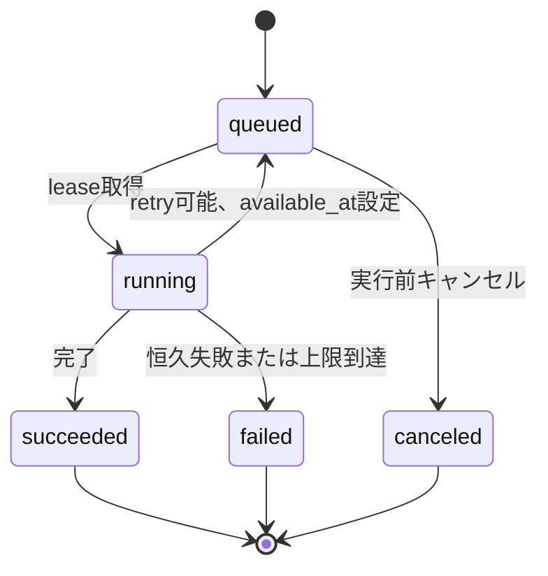
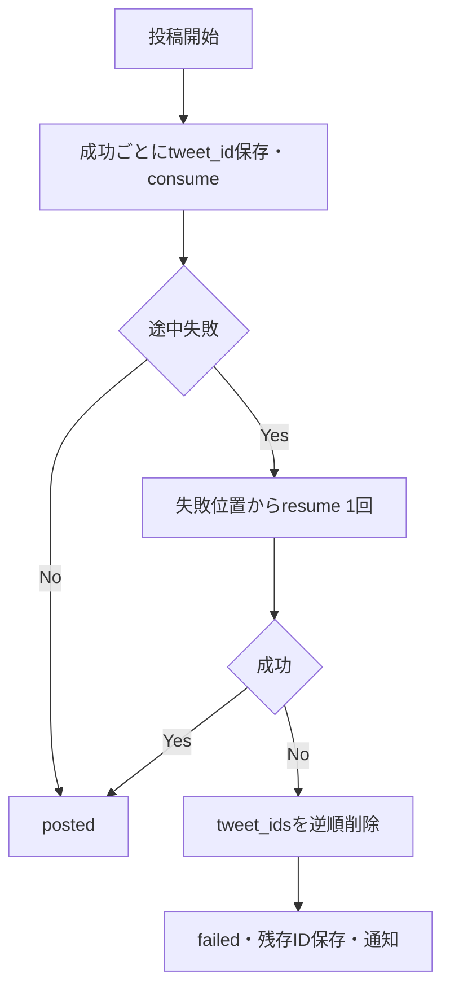

# 要件詳細 04: ジョブ・自動実行

| 項目 | 内容 |
|---|---|
| バージョン | v1.41 |
| 更新日 | 2026-08-20 |
| 関連 | PRD N/P/S/K/O、SC-05〜09、[ADR-0002](../decisions/0002-job-dispatch-fanout.md)、[ADR-0003](../decisions/0003-cron-window-claim.md) |

## 1. 実行モデル

- 長時間処理は`generation_jobs`へ先に永続化し、外部APIを呼ぶ。
- `kind`は実行内容、`trigger`は起点を表し、混同しない。
- すべてのjobは「1 job = 1 worker Function呼び出し」でdispatchする。worker（`POST /api/jobs/run`、`CRON_SECRET`認証）はjob IDを受け取り、認証・受領後すぐ202を返して本処理を`after()`で実行する。dispatch呼び出しは202受領までの軽量HTTPで、workerの処理完了を待たない。
- dispatch経路は3つ。(1) 手動操作: Server Action/API Routeがjob作成後、`after()`からworkerを呼ぶ。(2) 定時: `scheduler_tick`が到来スロットをenqueueした直後に各jobをdispatchする。(3) 子job: 親jobのworkerが子job（`parent_job_id`で紐付く画像生成・投稿実行）を本処理中に`queued`で作成し、**親jobがsucceededへ確定した直後に**、queuedの子jobをdispatchする。子は同一Xアカウント直列化（下記）により親running中はleaseできないため、作成直後ではなく親の成功確定後にdispatchする（dispatch失敗はqueuedのまま`scheduler_tick`が回収）。
- `scheduler_tick`は5分間隔（毎時00・05・…・55分）で起動する。**すべての起動が最初にenqueueクエリ（直前10分以内の未処理slotが対象）を実行する**。enqueueは`schedule_run_key`と`last_run_at`で冪等のため毎起動実行しても安全であり、定刻起動がlaunchd再試行込みで全滅しても、5分後・10分後のtickが§7.2の期限（+10分）内にenqueue・dispatchできる。初期はlaunchd、移行後はVercel Cron（`*/5`）から同じrouteを呼ぶ。
- `scheduler_tick`の回収は「tick内処理」ではなく「再dispatch」とする。dispatch失敗・stale解除で残ったqueued jobを`scheduled_for`昇順→`created_at`昇順で1起動最大50件dispatchする。tick内の処理順は「(1) 期限切れschedule起点jobのcancelと未enqueue slotの`schedule_missed`通知（§7.1/§7.2）→ (2) enqueue → (3) dispatch → (4) 通知メール・期限切れデータ回収」とし、+10分を過ぎたjobがdispatchされないようにする。
- 同一Xアカウントのjobと、同一userの`post_publish`は同時実行しない。workerはlease取得時にこの制約を検証し、取得できなければ何もせず終了する（jobはqueuedに残り、後続のdispatch・回収が拾う）。
- すべての外部API呼び出し前に契約、キー、X連携、利用枠を再検証する。
- `FEATURE_QUOTE_POST_ENABLED=false`の間は**引用URLが必須のパターン**（`post_patterns.requires_quote_url`。既定では引用ポスト）のjobを実行しない。既存のqueued jobも外部API・利用枠を消費する前に`feature_disabled`でcanceledにする。判定は**ジョブに凍結した`pattern_spec`**で行う（T-M8-129 U5。旧enum `p5` は撤去した。利用者が作った引用型も同じ扱いになる）。
- `learning_analysis`と`md_merge`はXアカウント単位で直列実行し、base_md更新時に開始時versionが変わっていないことを確認する。競合時は最新versionからmergeをやり直すかretryableとしてqueuedへ戻す。

## 2. Jobの対応

| `kind` | 主な実行ID | 結果 |
|---|---|---|
| `post_generation` | GEN-P1〜P6、内部GEN-FIX | draft |
| `image_generation` | GEN-IMG | draft.images更新 |
| `post_publish` | X投稿・thread | draft status/tweet_ids |
| `learning_analysis` | LRN-1〜3、同一job内MD-MERGE | learning source/base_md version |
| `md_merge` | 学習ソース削除時MD-MERGE | base_md version |
| `suggestion` | SUGGEST | improvement suggestions |

NEWSは全ユーザー共通の定時処理であり、ユーザー所有の`generation_jobs`へは保存しない。実行結果はSentry/logと`news_items.fetched_at`で追跡する。

## 3. 状態遷移

ユーザー再試行は元jobを変更せず、`parent_job_id`を持つ新しいjobを作る。履歴と利用枠イベントを追跡可能にするためである。

ユーザー操作は画面でUUIDの`request_key`を生成し、再送時も同じ値を使う。同じkeyが存在する場合は既存job IDを返す。子jobは`parent:{parent_job_id}:{kind}:{draft_id}`の決定的keyを使い、worker再実行で重複作成しない。

## 4. Leaseと回収

workerはdispatchで指定されたjob 1件を対象に、短いDB transactionで次を行う。

1. `pg_advisory_xact_lock`で対象`x_account_id`のロックを取得する。`post_publish`はさらに`user_id + ':post_publish'`のロックも取得する。job行のロックだけでは2つのworkerが互いの未commitのrunning遷移を見えず同時にlease成立し得る（write-skew）ため、直列化はadvisory lockで強制する。
2. 対象jobを`FOR UPDATE SKIP LOCKED`で取得し、`status = queued`かつ`available_at <= now()`であることを確認する。schedule起点の`post_generation`は`scheduled_for + 10分`以内であることも確認する（超過はcanceledにして`schedule_missed`通知を作る）。
3. 同時実行制約（同一Xアカウントのrunning job、同一userのrunning `post_publish`）を検証する。いずれかを満たさなければ何もせずcommitして202で終了する（jobはqueuedに残り、後続が拾う）。
4. `running`、`locked_at = now()`、`locked_by`、`attempt + 1`へ更新してcommitする（advisory lockはtransaction終了で自動解放される）。
5. 外部処理中は30秒ごと、またはstage変更時に`locked_at`をheartbeat更新する。
6. `locked_at < now() - 10 minutes`のrunning jobはstaleとする。`attempt < 3`ならlockを解除してqueuedへ戻し、`attempt >= 3`ならfailedへ確定する。failed確定と同一transactionで、当該jobの未返還reserve（`job:{job_id}:generation:refund`／`image:refund`の冪等key）をrefundする（通常経路のrefundと二重返還しない。要件03 §7.3）。

stale起因のfailed確定は`scheduler_tick`が行うため、workerの失敗経路と同一の終端処理もtickが実行する: `image_generation`はdraftを画像なし＋警告(failed印)で確定して後続へ進める（draft modeは`draft_created`通知／auto modeは`post_publish`作成。本文は使えるため`error`通知は作らない。auto modeの判定は親`post_generation` jobの`input.mode`から解決する）。`post_publish`はdraftを`failed`へ戻し`last_post_error`を保存する（`posting`のまま放置しない）。`md_merge`はsourceを`analyzed`へ戻して削除未完了を通知する。`image_generation`を除く各kind（`post_generation`／`post_publish`／`md_merge`）で`error`通知（dedupe_key `job:{id}:failed`）を作成する。この終端処理は`finalizeFailedJob`（`lib/jobs/terminal.ts`）に集約し、reserveのrefund（元reserve行から`counter_type`/`month`を引き継ぎ、`ref_event_id`へ元reserveを記録して`usage_counters`を-1）とkind別のdraft/source後始末を同一transactionで冪等に行う。reserveは文章系top-level job（生成・LRN・SUGGEST・MD-MERGE）と画像生成jobで実装済みのため、このrefundは実際に枠を戻す。workerの失敗経路では各handlerが自分の終端処理（draft確定・ソース差し戻し・error通知）をpoolで行うため、`finalizeFailedJob`は呼ばない（二重実行を避ける）。両経路の失敗通知は同じdedupe key `job:{id}:failed` を使うため重複しない。利用枠のrefundだけは worker 失敗経路でも中央（`failJob`）で行う（要件03 §7.1）。handlerが返還するとretryで差し戻される失敗でも返してしまい、次のattemptが再予約できなくなるため。**通知の文言と発行SQLは `lib/jobs/notifications.ts` の1箇所だけに置く**（R21・R22）。以前はworker経路がSQLリテラル、stale経路が文言テーブルと別々に持っていたため、同じ失敗が経路によって違う文面で届きうる状態だった（`draft_created`通知も3ファイルに同一SQLで重複していた）。**失敗確定の3手順（`error`/`usage`保存 → 原価台帳への記録 → 失敗通知）は `persistJobFailure` に集約する**（R23）。原価の記録は落としても全テストが緑のまま通り、AI費用が静かに過少計上されるため（CLAUDE.md 原則4）。

workerがhandlerの例外を受けてfailedへ確定する際は、失敗理由を必ず残す。handlerが既に`error`を保存していればそれを尊重して上書きせず、未保存のときだけ§4.10形式の汎用`error`（`code`／`message`／`retryable: false`／`stage`＝到達済みの`progress_stage`）を保存する。`code`は例外が持つエラーコード（`^[a-z][a-z0-9_]{0,62}$`に一致するもののみ）を使い、該当しなければ汎用の`job_failed`とする。`message`はコードから決まる定型文またはkind別の失敗通知本文であり、例外メッセージ・スタック・providerの応答をそのまま入れない。この確定は`status = running`の行のみを対象とするため、自己終端済み・stale回収でqueuedへ戻った行を書き換えず、再実行しても結果が変わらない。lease時（§4の手順4）は前attemptの`error`をクリアし、前回の失敗理由が現在の実行の結果として表示されないようにする。

外部API成功後にworkerが落ちる可能性がある処理は、provider request ID、draft、tweet_idなどの外部結果を先に保存し、再取得時にreconcileしてから再送可否を決める。

## 5. Retryとtimeout

| 対象 | 自動retry | 最終処理 |
|---|---:|---|
| AI 429, 5xx, network | 最大2回、指数backoff+jitter | failed |
| X read/media upload 429, 5xx, network | 最大2回、指数backoff+jitter | failed |
| X post作成の結果不明 | 自動再送しない。自分の直近投稿から照合 | 一意に確定できなければfailed＋手動確認 |
| X post削除の結果不明 | 対象IDを再取得して存在確認 | 削除済みなら成功扱い、判定不能はfailed |
| AI/X 401, 403 | なし | key/token失効、通知 |
| JSON parse | 同一top-level job内で再生成1回 | failed |
| 文字数超過 | 超過ポストだけGEN-FIX最大2回 | 警告付きdraft |
| Stripe webhook | アプリ内retryなし | 非2xxでStripe再送 |

`attempt >= 3`は自動取得しない。provider内部retryは`attempt`ではなく`usage.calls`に記録する。

retryの判定と差し戻しはworkerの中央finalizerが行い、handlerは分類を持たずに例外を投げるだけでよい。handlerが投げた例外は「明示の種別 → 自ら宣言する`retryable` → HTTP status（429=rate_limit／5xx=server／401・403=auth／その他=invalid）→ network系のerror code（`cause`側も見る）→ `AbortError`等の名前」の順で分類し、判断材料が無ければ`unknown`（＝再試行しない）とする。retryableかつ`attempt < 3`なら`status='queued'`へ戻し、`available_at = now() + backoff`、`locked_at`/`locked_by`/`progress_stage`/`error`をクリアする（まだ失敗が確定していないため画面に理由を出さない）。この差し戻しも`status='running'`の行だけを対象とし、handlerの自己終端は上書きしない。差し戻し後はbackoff分だけ待って同じjobを再dispatchする（次の`scheduler_tick`を待つと最大5分の空白になるため）。dispatchに失敗してもqueuedのままなのでtickが回収する。

再試行時の縮退: `post_generation`は`attempt`が増えるごとにWeb検索の`maxUses`を1段階（半減・下限1）縮小し、`pause_turn`が再びdeadlineに達することを避ける（プロンプト設計書 §5.2）。

Function開始から180秒を処理deadlineとする（maxDuration 200秒）。JSON修復や`pause_turn`継続など追加provider callは、残り時間が30秒未満なら開始せずretryableとしてqueuedへ戻す。各callのtimeoutは90秒とdeadlineまでの残り時間の短い方にする（初回call 90秒＋修復call 90秒が1 attemptに収まる）。

| 処理 | Function上限 | job内の目安 |
|---|---:|---:|
| 投稿生成・学習・提案 | 200秒 | 90秒（修復込み最大180秒） |
| 画像生成 | 200秒 | 90秒 |
| 投稿実行 | 200秒 | 60秒 |
| NEWS 1分野 | 200秒 | 90秒 |

## 6. 定時トリガー4本

| job | 初期launchd（JST・移行済み） | **production の Vercel Cron（UTC）** | 内容 | 1起動上限 |
|---|---|---|---|---:|
| `news_fetch` | **10:00〜20:00の2時間おき**（10/12/14/16/18/20時） | `0 1-11/2 * * *` | **3分野**（ai・investment・sns）を直近3時間ラップ取得（初回10時は夜間を埋める14h）、重複排除、時間単位ダイジェスト作成 | 3分野 |
| `scheduler_tick` | 5分間隔 | `*/5 * * * *` | due slot enqueue＋dispatch、queued/stale jobの再dispatch、期限切れschedule jobのcancel、通知メール・期限切れデータ回収、プロンプトsystem defaultの差分同期、日次サマリの作成、**毎朝の投稿分析jobの起票（JST8時以降・T-M8-94）** | enqueue 500、dispatch 50、cancel 500、email 100、DB cleanup各500、Storage cleanup 100 |
| `metrics_collector` | 毎時00分 | `0 * * * *` | dueなtweet_id別checkpoint更新 | 50 accountかつ500 tweet_idまで |
| `follower_snapshot` | 毎時10分 | `10 * * * *` | JST当日分がないactive Xアカウントを日次保存 | 100 accountまで |

**production は 2026-08-14 に Vercel Cron へ移行した**（T-M8-88。`vercel.json` の `crons`）。この表の「Vercel Cron」列が正本で、`vercel.json` との一致は `src/lib/ops/vercel-crons.test.ts` が検査する（4本あること・各schedule・UTCとJSTの取り違え・登録したpathのrouteの実在）。**定時実行が止まってもアプリは200を返し続け、画面には何も出ない**——2026-08-14、本番公開直後に4本とも未設定だったことを `npm run doctor` で初めて検出した。

スロットの設定時刻は09:00〜22:00の00/30分に限定し、定刻の`scheduler_tick`が到来スロットを即座にenqueue・dispatchする（正常系のleaseは定刻から数十秒以内）。transport失敗はlaunchd呼び出し側で30秒、60秒後に最大2回再試行する。定刻起動が3回すべて失敗しても、5分後・10分後のtickが未処理スロットを回収するため、§7.2の期限（+10分）内に通常2回の追加機会がある。

`news_fetch`は分野ごとに**取得結果を`news_fetch_outcomes`へ残す**（要件02 §3.19）。「0件」が「該当ニュースが無かった（正常な空）」のか「取得したが規定を満たさず全件破棄した（失敗による空）」のかを、cron応答（`categories[].dropped`/`dropReasons`・`emptyCategories`）と運営者向け状態確認（`npm run doctor`／`GET /api/cron/doctor`）の両方で区別できるようにする。除外理由をログにだけ出す形にしない（CLAUDE.md 原則1）。**判定は `src/lib/news-outcome.ts` の1箇所だけに置く**（T-M8-83）。以前は「取得窓より古いだけ＝良性」の判定がスモークと `doctor` に二重にあり日次サマリには無かったため、同じ状況を doctor は「該当なし」、サマリは「全件破棄」と正反対に通知していた。また**「取れてはいるが大半落ちた」状態はどの経路にも出ていなかった**（doctorは `fetched > 0` を素通り、サマリの抽出は `fetched = 0`）ので、取得件数が静かに減っても気付けなかった。除外が取得を上回る分野は、doctor では注意、サマリでは数字のみで出す（運営者が直せないことで警告は出さない）。`drop_reasons` には**何時間古かったか**を `_too_old_min_age_h` / `_too_old_max_age_h` として併せて残す（`_` 始まりは理由として数えない。境界すぐ外か、そもそも古い記事しか無かったのかを区別して対策を判断するため）。

取得したitemは契約検証（title/summary/URL/impact）の後に**新しさもコードで検証する**。プロンプトの「直近{{hours}}時間」という指示は守られない前提で組む。(1)`published_at`が現在時刻より未来（時計ずれ5分は許容）なら`published_at`を落としてitemは残し、並び順を`fetched_at`へ委ねる（任意項目のために本体を捨てない。未来日時はホームの重要ニュース最上位に居座り続けるため放置できない）。(2)取得窓＋24時間より古いitemは窓外の混入として捨て、理由`published_at:too_old`を残す。24時間の余裕は、日付だけで書かれた記事（00:00補完）や日付をまたいだ更新記事を正当に落とさないためにとる。

`news_fetch`は**取得対象の3分野**（`NEWS_FETCH_CATEGORIES`＝ai・investment・sns）を最大3並列で実行し、分野ごとに成功結果をcommitする。一部分野の失敗で他分野をrollbackせず、失敗分野は既存ニュースを保持してSentryへ記録する。全分野の処理がsettleした後、成功分野で新規保存されたニュースを対象に時間単位ダイジェストを作る。metrics/followerはdue対象だけを処理し、1回の上限を超えた残りは次の毎時起動へ委ねる。

metricsはXアカウントごとにtweet_idを最大100件へまとめ、異なるuser tokenを同じrequestへ混ぜない。metrics/followerの外部requestは最大10並列とし、Function deadlineで未開始分を次回へ残す。

launchdのHTTP再試行、切り替え時の二重起動、Vercel Cronの重複・並行起動に備え、各handlerは`job名 + 対象時刻窓`の受付（window claim）を最初に確保し、確保できなければ処理済み相当の2xxを返す。受付は`cron_runs`テーブル（`unique (job_name, window_key)`）へ`insert ... on conflict do nothing`する方式で、行を確保できた起動だけが本処理へ進む。Supavisor transaction modeプーラではセッションscope advisory lockがcheckout間で保持されずハンドラ全体をまたげないため、advisory lockは用いない（要件01 §3.2/§6、ADR-0003）。一度受け付けた時間窓は完了後も再受付しない（HTTP再試行・重複Cron起動での二重実行を防ぐ）。`news_fetch`は分野単位にも冪等keyを持ち、同じ時間窓のAIリサーチを重複実行しない。Vercel Cron移行後も呼び出し自体の再試行をVercelへ依存しない。

`cron_runs`の責務は重複受付防止のみで、本処理の成否・完了は持たない。**受付（cron claim）と業務処理の完了は別状態**であり、`cron_runs`の行だけで本体成功を判断しない。完了状態の正本は、永続ジョブは`generation_jobs.status`/`finished_at`、状態ベースcron（`scheduler_tick`/`metrics_collector`/`follower_snapshot`）は対象業務データの現在状態とする（`cron_runs`の保持・cleanupは要件02 §3.18・要件01 §9）。

実行保証:
- Cronトリガー: `(job_name, window_key)`単位で**at-most-once**（同一窓の受付は高々一度）。
- `generation_jobs`: retry（`attempt`上限3・指数backoff）とstale回収・scheduler再dispatchによる**at-least-once相当**。
- 状態ベースcron: 同一窓は再実行せず、**次窓で現在状態を再走査してcatch-up**する（tickはqueued/staleを毎回回収、metrics/followerはdue対象を毎回処理）。失敗・中断した窓の未処理は次窓が回収する。
- 副作用は冪等キーまたはDB制約（unique）で重複に耐える。
- 本システムのどの経路も**exactly-onceは保証しない**。

`news_fetch`は時間窓の欠落を許容しないが、NEWSは§2のとおり`generation_jobs`を用いず`news_items.fetched_at`で追跡する。そこで**各回が起動間隔より広い窓で重ねて取得**する（`{{hours}}`＝**初回10:00は14時間**（前日の最終回20:00からの空白を埋める）、**12:00〜20:00は3時間**（間隔2時間＋重なり1時間）。想定外の時刻に起動された場合も欠落させない方へ倒し初回と同じ14時間を使う。**値の正本はコード側**の`NEWS_FETCH_JST_HOURS`と`newsLookbackHours`（`src/lib/jobs/news-research.ts`）で、プロンプト設計書 §6.10 はそれを説明する）、隣の回と窓が必ず重なるため、**1回失敗しても次の回が拾える**設計とする（D-3の解決。ADR-0003）。窓の重なりによる重複は`source_url`のcanonical unique制約と`<known_urls>`で排除するため、`cron_runs`の受付は並行・重複起動の抑止のみを担い、欠落回復はラップ取得側が持つ（NEWSを`generation_jobs`化する案は不採用）。

## 7. スロットenqueue

### 7.1 条件

- `schedule_slots.enabled = true`
- 現在JSTの曜日・時刻がslotと一致する。tick遅延を考慮して直前10分以内の未処理slotを対象にする
- profileが`trialing`または`active`
- X accountが`active`
- `mode=auto`はXアカウントに現行versionの自動投稿同意があり、`automation_disabled_at is null`
- BYOKは必要なX/AI keyが`valid`
- premiumは**AIクレジット**に1回分の見積もり残量があり（画像ONなら画像の見積もりも足す）、autoなら通常投稿枠とURL付き投稿枠の両方にパターン別最大数から算出したロールバック安全残量がある（枠の定義は要件03 §7）
- 当日JSTの`usage_events`にある同一Xアカウントの`operation=post_create`件数が、パターン別最大数を足して50以下
- **引用URLが必須のパターンはスケジュール対象外**（毎回URLの指定が要るため自動実行できない）。DBのトリガと Server Action の両方で拒否する（要件02 §3.10・§3.21）

enqueueは**パターン設定を`pattern_spec`として凍結し、枠の生成入力を生成jobの`input`へ渡す**。渡すのは`instructions`・`theme`・`image_enabled`・`mode`と、`source_url`・`placeholder_values`・`prompt_override`（T-M8-135・要件02 §3.10）。**キー名は投稿作成画面が送るものと同一にする**——ずれると「予約では設定が効かない」という、画面からは説明できない差になる（生成側は`job.input`のキー名しか見ない）。未設定は`null`で渡す（空文字や欠落を混ぜない）。**`prompt_override`は`md`/`premium`のときだけ渡す**——プロンプトの編集はそのプランの機能で、standardでは画面がセクションごと消えるため、そのまま使うと**画面に出ていない指示で生成される**（原則1・原則2に反する）。判定は保存時の拒否と同じ `promptEditablePlan()` を使う。

スケジュールenqueue時は、出典を付けるP-1/P-3/P-4/P-6を「最終1件がURL付き、先行ポストは通常」と保守的に仮定する。最大数に対する必要残量はP-1=通常10＋URL1、P-2=通常1＋URL0、P-3=通常12＋URL1、P-4=通常8＋URL1、P-6=通常12＋URL1。生成後の投稿直前には実際にXへ送る各payloadで再分類し、通常/URL付き枠を別々に再判定する。

定刻から10分を超えた未実行slot（enqueueされないままのslotを含む）は遡って自動投稿しない。`scheduler_tick`が回収ステップで`schedule_missed`のerror通知を作り（冪等key `slot:{slot_id}:{yyyy-mm-dd}:{hh:mm}:missed`）、次回定刻を待つ。

### 7.2 冪等性

`schedule_run_key = slot:{slot_id}:{yyyy-mm-dd}:{hh:mm}`をjobのunique列へ保存する。enqueueと`last_run_at`更新を同一transactionで行い、同じ定時実行を二重作成しない。

予定時刻は`scheduled_for`へUTCでも保存する。schedule起点の`post_generation`が`scheduled_for + 10 minutes`までにleaseを取得できなければ、外部APIと利用枠を消費せずcanceledにして`schedule_missed`通知を作る。正常系ではtickがenqueue直後に各jobをdispatchするため、leaseは定刻から数十秒以内に取得される。この期限切れcancelは`scheduler_tick`が回収時に実施し（1起動500件まで）、通知は同一Xアカウント×同一時間窓で1件に`dedupe_key`で集約する。

## 8. 投稿生成

1. job lease取得、契約・key・利用枠を検証する。
2. premiumは**AIクレジット**を見積もり分reserveする（成功時に実費でsettle、失敗時は全額refund・要件03 §7）。
3. `validating`→`research`→`writing`とstage更新する。
4. AI出力をJSON、ポスト数、加重文字数、NG、出典で検証する。
5. draftを作成する。ニュース起点は`source_news_item_id`を保存する。
6. 画像OFFならdraftを確定する。draft modeは通知、auto modeは阻害警告がなければ`post_publish`子jobを作る。
7. 画像ONなら`image_generation`子jobを作り、本文生成jobは`succeeded`にする。画像子jobが成功または最終失敗した時点でdraftを確定し、draft modeの通知またはauto modeの`post_publish`作成へ進む。

> **2026-08-18 に実装（T-M8-143）**: それまで**成功経路に auto mode の `post_publish` 作成が無く、
> `mode=auto` の予約枠は下書きを作るが投稿しなかった**（`post_publish` を作っていたのは
> 画面からの手動投稿と、画像jobがstale/最終失敗したときの回収の2箇所だけ）。
> 連鎖は `src/lib/jobs/publish-chain.ts` の `ensureAutoPostPublishJob` に集約し、
> **冪等keyは `job:{draft_id}:post_publish:auto`（draft単位）**にしてある——
> 本文生成の成功・画像生成の成功・画像失敗の回収の3経路が同じ下書きで投稿へ進もうとするため、
> 経路ごとのkey（`parent:...`）にすると**同じ下書きが2回投稿されうる**。
> auto では `draft_created` 通知を出さない（投稿されるので「下書きができました」は誤った案内）。
> 阻害警告と自動投稿同意の確認は投稿直前に `post_publish` 側で行う（判定を2箇所に置かない）。

この連鎖により「生成→画像→投稿」の各段は独立したFunctionで実行され、段間の遅延はdispatch往復の数秒のみとなる。画像ONのautoスロットでも投稿は定刻から概ね5分以内、dispatch失敗が挟まっても10分程度で完了する。

画像失敗は本文生成jobをfailedにしない。画像子jobをfailed、draftを画像なし＋警告にし、自動投稿は本文だけ継続できる。

## 9. 画像生成

`image_generation`は画像ONの`post_generation`成功後に連鎖起動される子job（§1(3)）。親workerが決定的 request_key `parent:{parent_job_id}:image_generation:{draft_id}`＋on conflictで作成するため、worker再実行時も子jobは重複作成されない。親jobのinputに`image_prompt_override`/`base_md_override`（T-M8-93・投稿作成画面の「この生成にだけ使う」）があれば子jobのinputへ引き継ぎ、子はPT-IMGの解決と保存版base_md（セクション3抽出）を飛ばしてそれを使う。手動の画像再生成（`regenerateImage`）へは引き継がない。

1. premiumは**AIクレジット**を画像の見積もり分reserveする（文章と同じ1本の枠・要件03 §7）。
2. PT-IMG（アカウント.mdセクション3＋1ポスト目本文）でprompt作成後、画像providerを呼ぶ。
3. JPG/PNG/WEBP・5MB以下へ正規化する。
4. private Storageへ保存し、`drafts.images`（`storage_path`・`status`等）を更新する。
5. 最終失敗はreserve分を全額refundし、警告と再生成操作を残す。

Storage upload失敗も画像job失敗としてrefundする。X media uploadはAIクレジットと無関係で、投稿job内で行う。

`draft_created`通知の送信主体: 画像ON時は本文確定後に画像job（成功・失敗いずれも）が送る（画像OFFは`post_generation`が送る）。画像/Storage/PT-IMGの最終失敗時は本文を画像なしで確定し、`drafts.images`へ`status=failed`の印を残して`draft_created`を送り、子jobは`failed`にする（本文生成jobは失敗させない）。画像のreserve/refund（1・5）は実装済み（`reserveIfPremium`／`settleIfPremium`・`src/lib/usage/reserve-if-premium.ts`）。

画像再生成は既存画像を残したまま新規生成し、新画像のStorage保存とdraft参照の切替が成功してから旧objectをbest effortで削除する。再生成失敗時は既存画像を維持する。

## 10. 投稿実行

1. draftをlockし、`draft`または再試行可能な`failed`を`posting`へ変更する。
2. 契約、X token、日次上限、premiumの通常/URL付き投稿残量、thread、警告を検証する。auto起点の`post_publish`はこの時点でも現行versionの自動投稿同意と未撤回を再検証する。**加重文字数の上限（280）超過は`mode`を問わずここで失敗させ、X APIを1件も呼ばない**（要件06 §7と同じ判定をサーバー側でも行う。Xは超過を400で拒否するため、スレッド途中で拒否されると先行ポストがX上に残り取り返しがつかない）。判定は保存済みの`weighted_length`ではなく**そのとき投稿する本文**（引用URLが必須のパターンは`quote_url`合成後）から測り直す。**Xへ1件も投稿していない失敗はdraftを`failed`にせず`draft`へ戻し、`last_post_error`に理由だけ残す**（日次上限と同じ扱い）。`failed`にすると編集も複製もできず、案内した「編集して短くする」が実行できない行き止まりになる。残量は要件03 §7.4の通常/URL付き別ロールバック安全量を必須とし、同一userの他の投稿jobがrunningなら処理しない。
3. 引用URLが必須のパターンは`quote_tweet_id`で対象ポストを再取得し、取得成功後に正規化済み`quote_url`を1ポスト目の本文末尾へ合成する。対象取得不能、URL不正、合成後の加重文字数超過はX APIを呼ばず失敗にする。**本ステップは未実装**（`post-publish.ts`は対象ポストを再取得しない。要件06 §5 参照）。ただし**引用URLが必須（`drafts.requires_quote_url`）なのに`quote_url`が未設定の下書きは、X APIを呼ばずに`draft`へ戻す**（step2 と同じ扱い。フラグをONにした瞬間に引用先の無い引用ポストが出るのを防ぐ）。
4. 画像があればX media uploadを完了し、media idを得る。失敗時は本文を投稿しない。
5. 1ポスト目を通常投稿として送信する。引用型も`quote_tweet_id`は指定せず、対象URLを含む本文を使う。画像ありは`media_ids`を指定する。
6. 後続は直前の自分のtweet_idへのreplyとして投稿する。
7. 各成功直後にtweet_idを保存し、全プランで`post_create` consume eventを作る。premiumだけ月次counterを同一transactionで加算する。
8. 全件成功でdraft rowを削除せず、`status=posted`、`root_tweet_id`、`posted_at`、`posted_mode`を更新する。rowは下書き一覧から外れ、投稿履歴とtweet_id別実績の正本になる。

原価集計対象のX/AI外部呼び出しは成功・失敗を問わず、返却されたrequest ID、resource数、token/search usage、実行時単価、推定原価を`external_api_usage_events`へ冪等保存する。provider本文、投稿本文、prompt、tokenは保存しない。X media uploadは運用logだけへ記録し、原価台帳から除外する。X単価は環境変数`X_COST_*`のsnapshotを採用し、投稿作成は本文のURL有無で通常/URL付き単価を分ける。読取（`x_post_read`/`x_user_read`）の単価は`X_COST_POST_READ_USD`/`X_COST_USER_READ_USD`のsnapshotを使い、**応答のresource数で乗算**して記録する（pay-per-usageは応答1件ごとに課金する。2026-08-15・T-M8-91で「読取は課金されない」という誤った前提を修正した。未設定の環境では0で記録する）。0件応答の読取は`quantity=0`・推定原価$0で記録する（呼び出しの痕跡は残す。直近30日に投稿が無いアカウントの毎朝の自動読取で毎日発生する形。2026-08-15・T-M8-94）。`dry_run`は実外部呼び出し（実原価）が発生しないため原価台帳（`external_api_usage_events`）には記録しない。失敗時は resource 未作成のため推定原価0で記録する。

AI呼び出しが例外で終わった場合（レート制限・タイムアウト・接続断など、providerが応答を返さなかった場合）も、`status: failed` の provider call として記録する。SDKは例外時にusageを返さないため、残せるのは発生事実・provider・model・operation・latency・request ID・安全なerror code（HTTP statusは`http_<status>`、SDKのcode/nameはそのまま、いずれも無ければ`unknown_error`）に限られ、token数は0・推定原価は`null`とする。providerの応答本文はここにも保存しない。この記帳は失敗の確定とは独立で、retryで差し戻されるattemptの分も記録する（消費した実原価は発生しているため）。

post作成でtimeout、接続切断、5xx等により作成成否が不明な場合は同じ本文を再送しない。対象アカウントの直近投稿を取得し、本文、作成時刻、reply先、quote先が一致する候補が1件だけならそのtweet_idを保存して継続する。候補なし・複数は`post_state_unknown`でfailedにし、X上の確認を促す。

`X_POSTING_MODE = dry_run`では投稿・削除・media uploadのX API書き込みを行わず、擬似tweet_idをUIへ返す。ただし投稿workerの記帳（`tweet_ids`保存・全プランの`post_create` consume event・`status=posted`/`root_tweet_id`/`posted_at`/`next_metrics_at`更新・posted通知）は、dev/preview（dry_run必須, 要件01 §3.1）でも投稿フローと日次上限を検証できるよう実行する。原価台帳（`external_api_usage_events`）への記録とpremium月次counter（`usage_counters`, M6）の加算は行わない。実績取得（`/2/users/me`・tweet読取）はmodeに依らず実行する。

## 11. スレッド途中失敗

同一投稿job内では保存済み`tweet_ids.length`を再開位置とし、失敗位置から1回だけ再開する。

- rollback削除にもX APIのretry方針を適用する。削除成功ごとに全プランで`post_delete` consume eventを作り、premiumは月次投稿counterをさらに1加算する。
- 削除成功後も`tweet_ids`は監査用に保持する。`last_post_error.deleted_tweet_ids`へ削除確認済みID、`remaining_tweet_ids`へX上に残るIDを保存する。
- premiumの通常/URL付き投稿枠は投稿成功分を返還せず、削除成功分も元投稿と同じ枠へ追加消費する。作成後にロールバック削除できたtweet_idは同じ枠を合計2消費、削除失敗は追加消費なしとする。投稿前の安全残量確認により、削除が各投稿枠上限で妨げられないようにする。
- 自動投稿でも手動投稿でも同じ規則を適用する。
- 1件でもtweet_idを作成したfailed draftは直接再投稿しない。曖昧状態と残存IDが解消済みなら本文・画像・引用情報を新しいdraftへ複製し、`parent_draft_id`で元draftへ結び付け、空の投稿状態から再開する。複製にはAIを使わずAIクレジットも消費しない。

## 12. 学習・改善

- LRN-1〜3はsource単位の`learning_analysis` job。参考アカウントは直近20件、参考投稿は対象1件、自己投稿は直近100件を取得し、分析結果保存後に同じtop-level job内でMD-MERGEする。mergeには対象セクションの現在値と、同セクションへ反映する全active sourceのanalysisを渡す。
- ~~own_posts再取り込みの30日制御~~ **own_posts（自分の過去投稿から学習）は2026-08-15に廃止**（T-M8-103。毎朝の投稿分析K-2と重複）。learning_analysisの対象は参考アカウント（PT-L1）と参考投稿（PT-L2）のみ。二重送信は進行中jobの`job_conflict`で止める。
- `learning_analysis`の失敗時は`error`に到達済みstage（`research`=素材取得／`writing`=分析call以降）と`provider_raw_error`（providerまたはX APIの生の文面）を残す。画面には出さない（要件06 §5）が、これが無いと原因を追えない。
- **`provider_raw_error`は生成・学習・画像・提案の4経路すべてで残す。上限と切り詰めは`src/lib/ai/raw-error.ts`（`RAW_ERROR_MAX`＝4,000字）が正本**（F4・F5）。AIの出力が検証に通らなかったとき（`invalid_output`）は**各試行の応答本文**を「1回目の応答: …／2回目の応答（修復指示つき）: …」の形で入れる。修復callを挟むため両方を残す（初回が妥当なJSONで長さ超過・修復callは中身が違う、という組み合わせが実際にあり片方では特定できない）。応答が空だった試行も「（空）」として残す（何も返らなかったこと自体が手がかりで、行が消えると「そのcallが無かった」と読めてしまう）。**この値をブラウザへ返さないことは`getGenerationJob`のクエリで担保する**（`error - 'provider_raw_error'`。描画側の注意に頼らない・要件01 §8）。運営者は`npm run smoke:live`とDBで中身を見る。
- **ニュース取得は`generation_jobs`を持たないため`news_fetch_outcomes.error_code` / `provider_raw_error`へ同じ上限で残す**（T-M8-86）。契約違反で落とした候補の中身（先頭5件まで）と、分野が例外で終わったときの原因を保存する。**`published_at:too_old`だけの除外では本文を作らない**——窓より古いだけのitemは契約を満たしており良性なので、本文を積むと「正常な空」と混ざる。**cron応答（`GET /api/cron/news-fetch`）・スモーク・日次サマリへは載せない**（routeが結果をそのまま応答へ展開するため、型に載せた時点で外へ出る）。`doctor`には`error_code`と、**そこから求めた「運営者が直せる型」**を添える（T-M8-163）。型は`classifyProviderFailure`（`src/lib/ai/provider-failure.ts`）がクレジット残高不足／レート制限／キー無効／モデル名不正／入力長超過／提供元障害／不明の7種へ落とし、画面へ出るのは**その型に対応する定型文だけ**——応答本文は分類にだけ使い、選択したスコープから外へ出さない（`diagnostics.test.ts`が応答へ漏れないことを固定する）。以前は`error_code`だけを添え本文をselectしない方針だったが、**`http_400`からは原因が分からず運営者が自力で辿れなかった**（2026-08-20、実際はAnthropicのクレジット切れで運営者が直せるものだった）。
- **日次サマリ**（`type=summary`・T-M7-29）は`scheduler_tick`が作る。JST8時以降の最初のtickで、Xアカウント連携済みかつ`notification_config.summary`のどちらかがONの利用者へ1通だけ作成する（冪等keyは`summary:{JSTの日付}`で、5分ごとのtickから何度呼ばれても1日1通）。内容は直近24時間の生成・投稿の成否、**テーマごとの連続0件日数**（3日以上を強調）、直近の取得で全件破棄されたテーマと理由（**「窓より古いだけ」は除く**）、**取れた数より捨てた数が多かったテーマ**（警告にはせず数字のみ）、止まっている処理、**送信待ち（`queued`）と送れなかった（`failed`）お知らせメール**（`failed` は終端状態で `recoverQueuedEmails` が拾わないため自動では回収されない。サマリと `doctor` に出し、再送は通知ベルの該当行から行う・要件06 §2／要件05 §10）、当月費用、**データベースの使用量**（無料枠500MBに対する割合。80%で注意・95%で異常。超えると組織内の全プロジェクトが停止するため手前で知らせる・T-M7-43）。「いまの状態」を見る`npm run doctor`と違い、**日をまたぐ推移**＝静かな劣化を見るのが役割。問題が無い日も数字を出す（「問題なし」だけでは止まっていても同じに見える）。
- 適用済み学習sourceの削除はstatusを`removing`にして単独`md_merge` jobを作り、premiumのAIクレジットを消費する（実費ベース）。削除対象のanalysisと、残る全active sourceのanalysisから対象セクションを再構築し、削除sourceだけに由来する知見を残さない。merge成功時にbase_md新version作成とsourceの`removed`化を同一transactionで確定する。
- `removing`中は古い知見での生成を避けるため対象Xアカウントの新規生成を停止する。merge最終失敗時はsourceを`analyzed`へ戻して削除未完了を通知する。未適用のpending/failed sourceはAIを呼ばず直接removedにする。
- SUGGESTは**毎朝8:00 JSTに自動実行する**（2026-08-15・T-M8-94。手動の`refreshSuggestions`は廃止した）。起票は`scheduler_tick`の`enqueueDailySuggestions`——JST8時以降のtickで、対象アカウント（`status='active'`かつ契約が`trialing/active`かつ〔premium または validなAIキーあり〕）ぶんの`suggestion` jobを`trigger='schedule'`・request_key `sug-daily:{x_account_id}:{JST日付}`で冪等作成する（uniqueが1日1回を保証。BYOKのAIキー条件は、キーが無いと毎朝失敗通知が届き続けるのを防ぐ入口ゲート）。dispatchはtickのdispatchフェーズが拾う。
- **取得は増分**: ハンドラが`GET /2/users/:id/tweets`（リポスト・返信を除く・メトリクス付き）を、保存済み最新投稿の**48時間前**から取得する（初回は`start_time`なし＝期間で区切らず最新100件。1回最大100件=X読取費用の上限$0.50。T-M8-97）。48時間の重なり分はupsertでメトリクス（表示回数等）を追い直す——重なりが無いと直近投稿の実績が「取得した朝の値」で凍結される。表示回数（`non_public_metrics`）はX公称では投稿から30日以内しか提供されないためnull許容で扱う（実挙動では30日超の投稿にも返る場合があることを2026-08-15に実アカウントで確認。nullは「表示回数が不明」であり0と区別する）。取得結果は`x_timeline_posts`（要件02 §3.20）へ保存し、本サービス経由の投稿には`drafts.tweet_ids`の突合で型とテーマを付与する（一度付いたら保持。外部の投稿はnull）。分析時は**直前のレポート**（format=2）を読み込みプロンプトへ渡す（前回の推奨の効果検証と提案の連続性のため。前回以降の新規投稿数はコードで数えて渡す。参照したレポートidはevidence.previous_idに残る・T-M8-98）。
- **分析は保存済みの全投稿**（新しい順に最大300件=AI入力の上限）を対象にする。固定の分析軸と「3投稿以上・差20%以上」の条件は持たない。良かった投稿の特徴づけはPT-SUGGESTの自由分析に任せ、出力を実行可能な設定（推奨パターン・テーマ・画像有無・そのまま貼れるプロンプト全文）に固定する（検証はプロンプト設計書 §6.15）。
- **AIクレジットは消費しない**（premium含む・2026-08-15変更）。自動実行では利用者の操作なしに枠が減るため。費用は原価台帳（X読取・AI）が記録する。保存済み投稿が0件ならLLMを呼ばずレポート0件で正常終了する。SUGGESTはbase_mdを読まない。X取得の失敗は`x_fetch_failed`として理由を保存・通知する（静かに0件にしない・原則1）。
- レポートは**1件**（総評＋advice）で、表示専用とする。`good_posts[].id`は`<posts>`に含まれるIDだけを許可し（zod検証、違反は修復1回→失敗）、`evidence.format=2`・`post_count`・`analyze_limit`をコードで付与して保存する（要件02 §4.11）。アカウント.md・プロンプトへの自動反映は行わず、ユーザーが投稿作成・スケジュール・AI設定のプロンプト編集（md/プレミアム）で自ら反映する。`listSuggestions`は最新の成功`suggestion` jobの分だけを返す。プロンプト・出力schemaを変えたときは`npm run check:suggest`（実AI 1周・約$0.02）を回す。

## 13. メトリクス・フォロワー

- `metrics_collector`は`status=posted`の全tweet_idに加え、`status=failed`で`last_post_error.remaining_tweet_ids`に残るIDを対象にする。投稿後1日・7日・30日表示用checkpointが未取得のIDから最大100件ずつ取得し、1 tweet_idあたりMVPでは最大3回読む。rollback削除確認済みIDは対象外とする。
- public metricsと、所有ポストで取得可能なnon-public metricsを要求する。取得不能fieldはnullを保持する。
- 取得値はtweet_id配下の`1`/`7`/`30` checkpointへ別々に保存し、後の取得で過去checkpointを上書きしない。
- 投稿完了時、または部分失敗でX上の残存IDが確定した時に`next_metrics_at`を1日checkpointへ設定し、各回の完了後に次のdueへ進める。対象tweet_idがすべて30日取得済みまたはunavailableなら`metrics_completed_at`を設定して回収対象から外す。
- checkpoint日数（1/7/30）の基準時刻は`drafts.posted_at`とする。`posted_at`は投稿成功時（投稿時刻）に加え、部分失敗でX上に残存IDが確定した時にも設定する（残存確定時刻。post_publishが両経路で設定し、metrics_collectorのアンカーとする）。アンカーを持たない行（`posted_at is null`）は収集対象にしない。
- 収集対象IDが無くなったdue draft（全ID取得済み、または`ambiguous_delete_tweet_ids`のみでremaining空 等）も`next_metrics_at`だけ前進させてdue窓から外す（同一行の無限再選定を防ぐ）。
- 1起動あたり50 account・500 tweet_id・外部request最大10並列を上限とし、Function deadline超過分は次回毎時起動へ委ねる。1アカウントのtoken取得失敗（失効）や読取失敗（401/403/429枯渇/5xx）はそのaccount/draft単位で隔離してスキップし、run全体を落とさない（失効はaccountスキップ、一時失敗は`next_metrics_at`据え置きで次窓が再走査）。
- 30日表示用checkpointはnon-public metricsの取得期限を越えないよう投稿後29日〜30日未満で取得する。期限内の取得に失敗したprivate fieldはnullのまま確定し、public metricsもMVPでは更新終了する。
- X上で削除済み・取得不能と確定したtweet_idは`unavailable`として以後のcheckpoint対象から外し、他のtweet_idの実績は継続する。
- `follower_snapshot`はJST当日分snapshotが無い`status=active`のXアカウントを対象に、user token別で自アカウントの`followers_count`を読み`(x_account_id, snapshot_date)`へupsertする（unique制約で同日再実行でも重複rowを作らない）。1起動100 account・最大10並列。token取得失敗（失効）や読取失敗・`followers_count`取得不能はaccount単位で隔離してskipし、書き込まず次回毎時起動へ委ねる。

## 14. 通知

- **production 以外は外部SMTPへ送信しない**。`APP_ENV != production` かつ `SMTP_HOST` がループバック以外なら transport を構築せず skip する（開発機の `.env.local` に実SMTP資格情報が入っていると `scheduler_tick` が溜まった queued 通知を一括実送信するため。2026-07-27）。

| event | type | dedupe key例 | link |
|---|---|---|---|
| 下書き作成 | `draft_created` | `draft:{id}:created` | `/app/posts?tab=drafts&draftId=...` |
| 自動投稿完了 | `posted` | `draft:{id}:posted` | `/app/posts?tab=history&draftId=...` |
| job失敗 | `error` | `job:{id}:failed` | 対象画面 |
| 時間単位ニュースダイジェスト | `news` | `news-digest:{window_started_at}` | `/app/news?from=...&to=...` |
| X/key失効 | `error` | 対象ID＋失効時刻 | `/app/settings` |

通知row作成時に設定をsnapshotし、メールONなら`queued`にする。送信成功は`sent`、最終失敗は`failed`とし、秘密値を含まない要約だけ保存する。

- ニュースは個別通知しない。JSTの取得時刻を起点とする1時間窓ごとに、`news_config.categories`と`impact_filter`へ一致する新着をユーザー単位で集約する。複数分野を1件へまとめ、該当0件なら通知rowを作らない。
- ダイジェストは`subscription_status in (trialing, active)`かつニュース通知のいずれかのchannelがONのユーザーだけへ、一括`insert ... select`相当でfan-outする。`user_id + dedupe_key`で再実行を冪等化し、両channelがOFFならrowを作らない。
- タイトル・本文には高impact、同一impactなら新しい順で最大5件を掲載し、全件数と一覧リンクを付ける。対象IDは`news_config.max_items`（1〜100、既定20）まで、時間窓とともに`payload`へ保存する。
- 一部分野が失敗した時間帯は成功分野だけでダイジェストを作り、失敗そのものを利用者へニュース通知として送らない。運営監視へ記録し、次回取得を継続する。
- notification commit後に`after()`でメール送信を起動し、残ったqueuedメールは`scheduler_tick`（5分間隔）が最大100件、最大10並列で回収する。最古のqueuedメールが10分を超えた場合はSentryへ警告する。
- provider送信は`notification:{id}`を冪等keyにし、429/5xx/networkは最大3 attempt、指数backoffで再送する。401/403または3回失敗は`failed`にする。
- アプリ内一覧は`in_app_enabled = true`だけを返す。メールだけ有効なrowも送信台帳として保持する。
- `scheduler_tick`のcleanupは40日を過ぎた`news`通知を先に削除し、その後に参照されない40日超の`news_items`を各500件まで削除する。`external_api_usage_events`の40日超の明細も1起動500件まで削除する。期限切れ削除の失敗は投稿系jobを失敗させず、Sentryへ記録して次回へ繰り越す。
- `scheduler_tick`は、作成から24時間を過ぎてもdraftから参照されないStorage画像も1起動100件までbest effortで削除する。参照確認と削除の間に参照された場合に備え、削除直前にも未参照であることを再確認する。

## 変更履歴

| version | 日付 | 変更内容 |
|---|---|---|
| v1.35 | 2026-08-18 | 予約枠の生成入力を生成jobの `input` へ渡すことを明記（T-M8-135） |
| v1.36 | 2026-08-18 | auto modeの `post_publish` 連鎖を実装（T-M8-143）。冪等keyはdraft単位 |
| v1.37 | 2026-08-18 | news_fetch の取得窓を現行（初回14時間・以降3時間）へ。値の正本がコード側であることを明記（T-M8-144） |
| v1.38 | 2026-08-18 | 利用枠の記述をAIクレジット制へ揃えた（T-M8-144。生成枠・画像枠の2枠制の記述が残っていた） |
| v1.39 | 2026-08-20 | 期限到来した日時予約の下書きを投稿へ流す手順を追加（T-M8-157） |
| v1.40 | 2026-08-20 | providerの失敗をdoctorで「運営者が直せる型」として出す方針を追加（T-M8-163） |
| v1.41 | 2026-08-20 | doctorの判定を運営者へ1日1回メールで届ける仕様を追加（T-M8-164） |

### 日時予約された下書きの投稿（T-M8-157）

`scheduler_tick` は due slotのenqueueの直後に、**期限が来た日時予約の下書き**を投稿へ流す（`enqueueDueScheduledDrafts`）。`schedule_slots` が「投稿を生成する」トリガーである一方、こちらは**既にある下書きを投稿する**。対象は `status = 'draft'` かつ `scheduled_at <= now()` で、1tickあたり100件まで。投稿そのものは既存の `post_publish` job に委ね、**自動投稿同意・日次上限・阻害警告の判定と `last_post_error` への記録はhandlerが持つ**（判定を2箇所に置くと片方だけ直して食い違う）。冪等keyも `autoPostPublishKey`（draft単位）を共用するため、手動投稿・スロット由来の連鎖と同時に進んでも二重投稿にならない。

**期限到来時に `scheduled_at` は消さない。** 投稿が終われば `status` が `posted` になり対象条件から外れる。ここでnullへ戻すと失敗時に「予約した記録」が消えて原因を辿れなくなる。対象Xアカウントが active でない予約は流さず `skippedInactive` として**0件とは別の値で数える**（原則1）。

### 運営者への状態メール（T-M8-164）

`scheduler_tick` は毎朝8時JST以降の最初の回で、`doctor` と同じ判定（`collectDiagnostics`）を実行し、**`error` と `warn` があった場合だけ** `SUPPORT_EMAIL` へメールを送る。**定時トリガーは増やさない**（原則3）。

- **毎朝の日次サマリには混ぜない。** あれはX連携済みの**全利用者**へ配るもので、設定ミス・APIキー・残高といった運用の内情を利用者へ届けてはならない。宛先は運営者だけ。
- 重複送信は `cron_runs` の `(job_name='operator_alert', window_key='operator-alert:{環境}:{JST日付}')` で止める。**異常が無くて送らなかった日も窓を確保したままにする**（同じ日に何度も判定を走らせない）。
- **異常が無い日は送らない。** 正常を毎日送ると本当の異常が埋もれて読まれなくなる（T-M7-44）。
- 本文には T-M8-163 の「直せる言葉」と次の一手を載せ、**providerの応答本文は載せない**（要件01 §8）。
- 送信は `lib/email/operator-mail-server.ts`。通知メールとは別入口だが**同じ `canSendViaSmtp` のガードを共有**し、非productionから外部SMTPへは送らない（`outbound-channels.ts` の `smtp` へ登録済み）。
- **これが無かった間**、2026-08-19 10:00 JST から1.5日間ニュースが全滅していたのに運営者へ何も届かず、運営者が自分で `doctor` を叩いて初めて分かった。
