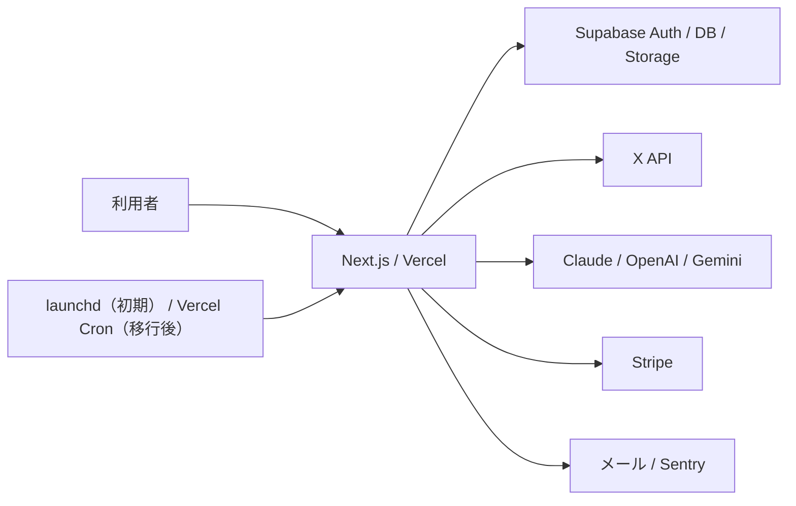

# 要件定義書：Space AI（X自動投稿Webアプリケーション）

| 項目 | 内容 |
|---|---|
| ドキュメント | 要件定義の全体像・詳細仕様への索引 |
| バージョン | v1.3（確定版） |
| 更新日 | 2026-07-21 |
| ステータス | v1.3（開発タスク化可能） |
| 参照 | [PRD](./PRD.md)／[要件詳細](./requirements/README.md)／[AI実行・プロンプト設計書](./プロンプト設計書.md) |

## 1. この文書の役割

本書は要件定義の入口と全体像を示す。実装時の正本は本書から参照する`docs/requirements/`の各詳細文書とし、DBカラムやAPI契約などの詳細を本書へ重複記載しない。

## 2. 詳細文書

| 文書 | 正本となる内容 |
|---|---|
| [01 システム構成・環境](./requirements/01_system_architecture.md) | アーキテクチャ、技術スタック、環境変数、ルーティング、認証ガード |
| [02 データモデル](./requirements/02_data_model.md) | 18テーブル、enum、制約、index、RLS、JSONスキーマ、seed |
| [03 認証・課金・利用枠](./requirements/03_auth_billing_usage.md) | Supabase Auth、Stripe状態、プラン変更、利用枠台帳 |
| [04 ジョブ・自動実行](./requirements/04_jobs_and_automation.md) | DBキュー、worker起動、定時トリガー4本、lock、retry、失敗復旧 |
| [05 API / Server Actions](./requirements/05_api_server_actions.md) | API Routes、Server Actions、認可、入出力、エラー |
| [06 画面・初期設定・投稿](./requirements/06_screens_onboarding_posting.md) | SC-01〜11、初期設定と実行前提、投稿編集、引用、画像、実績 |

AIの実行ID、ベースmd、プロンプト、構造化出力、検証は[AI実行・プロンプト設計書](./プロンプト設計書.md)を正本とする。

## 3. システム全体像

Space AIはNext.js App Routerの単一アプリとしてVercelへ配置する。初期環境はVercel ProとSupabase Freeを使用し、Stripeを課金に、X APIを連携・投稿・実績取得に使用する。長時間処理は`generation_jobs`をDBキューとして管理し、Vercel Functionのworkerが実行する。定時APIの起動は初期に常時稼働Macの`launchd`を使い、運用条件到達後に同じendpointをVercel Cronへ切り替える。

## 4. 画面一覧

| ID | 画面 | パス |
|---|---|---|
| SC-01 | LP | `/` |
| SC-02 | 会員登録 | `/signup` |
| SC-03 | ログイン・パスワード再設定 | `/login`, `/reset-password` |
| SC-04 | プラン選択 | `/plans` |
| SC-05 | ホーム | `/app` |
| SC-06 | ニュース | `/app/news` |
| SC-07 | 投稿ハブ | `/app/posts` |
| SC-08 | スケジュール | `/app/schedule` |
| SC-09 | 分析 | `/app/analytics` |
| SC-10 | AI設定 | `/app/ai-settings` |
| SC-11 | アカウント設定 | `/app/settings` |

## 5. 基盤・運用要件サマリ

- 認証はSupabase Auth、課金状態はStripe webhookから`profiles`へ同期する。
- Stripeの状態を閲覧可・実行可へ明示的にマッピングし、イベントの冪等性と順序逆転を防ぐ。
- DBは18テーブル。ユーザー所有データはRLS、秘密値はAES-256-GCMで暗号化する。外部API利用量と推定原価は専用台帳へ記録する。
- プレミアムは月間で通常投稿200件、URL付き投稿20件、文章生成100回、画像生成20枚。投稿作成成功はtweet_id単位で該当枠を1消費し、ロールバック削除成功は元投稿と同じ枠をさらに1消費するため、作成と削除で合計2消費となる。
- 長時間処理は`generation_jobs`で追跡し、すべてのjobを「1 job = 1 worker Function呼び出し」でdispatchする（手動は即時、定時は`scheduler_tick`から、子jobは親workerから連鎖dispatch。ADR-0002）。
- 定時トリガーは`news_fetch`、`scheduler_tick`（5分間隔）、`metrics_collector`、`follower_snapshot`の4本。初期はlaunchd、移行後はVercel Cronから同じAPI Routeを呼ぶ。ニュース通知は取得時刻ごとの時間単位ダイジェストとする。

## 6. ユーザーフロー要件サマリ

- 11画面をApp Shellとタブで構成し、確認・投稿をモバイルでも完了できるようにする。
- 専用のオンボーディングは持たない。生成・投稿系の操作は実行時にサーバー側で前提条件（契約・キー・X連携・発信設定）を検証し、不足時はエラーと設定画面への導線を返す。ホームには不足項目の初期設定ガイドを表示する。
- Xへの手動投稿はOAuth認可を根拠に実行し、自動投稿は別途明示同意を取得したXアカウントだけで実行する。自動投稿の停止は即時反映する。
- 投稿パターンP-1〜P-6に画像生成オプションP-7を付け、生成、編集、投稿、履歴を投稿ハブへ集約する。
- P-5は将来提供用に対象URL付き通常投稿の仕様を保持するが、v1.0初期リリースはfeature flagの既定値OFFで非活性とする。対象ポスト本文をLLM入力へ渡す契約の完成後に別途有効化する。
- 投稿実績はtweet_idsごとに保存・表示し、スレッド合算は表示時に計算する。
- 投稿成功後のdraftは物理削除せず`posted`へ遷移し、下書き一覧から投稿履歴へ移す。
- 外部呼び出し、cron、OAuth callback、webhookはAPI Routes、アプリ内更新はServer Actionsを基本とする。

## 7. 要件の境界

- 「何を作るか、料金、スコープ、成功指標」はPRDを正本とする。
- 「どう作るか、DB、API、画面、ジョブ」は`requirements/`を正本とする。
- 「AIをどう動かすか、何を検証するか」はプロンプト設計書を正本とする。
- 外部APIの価格・仕様は変更されるため、リリース判定時に公式情報を再確認する。実装で吸収できる差異はadapterへ閉じ込め、プロダクト要件を暗黙に変更しない。
- 開発順、マイルストーン、担当、見積もりは開発バックログで管理し、本書へ重複させない。

## 8. 変更履歴

| バージョン | 日付 | 内容 |
|---|---|---|
| v1.0 | 2026-07-19 | 要件を6文書へ分割。12画面、17テーブル、定時トリガー4本、認証・課金、通常投稿200件・URL付き投稿20件の利用枠、時間単位ニュースダイジェスト、Claude既定、P-5の対象URL付き通常投稿、tweet_id別実績を定義。初期Supabase Free、初期launchdからVercel Cronへの移行、運営X AppのOAuth代理投稿と自動投稿の別同意、30日保持、投稿済みdraftの履歴化、セルフサービスのアカウント削除対象外を反映 |
| v1.0 | 2026-07-20 | P-5は将来用仕様を保持し、対象ポスト本文のLLM入力契約が完成するまでfeature flag既定値OFFで初期提供を停止 |
| v1.1 | 2026-07-20 | 改善提案を表示専用へ変更（K-3削除・ベースmd6セクション化）。文章・リサーチproviderを単一選択へ統一。ジョブ実行を「1 job = 1 Function呼び出し」のdispatch方式へ変更し、`scheduler_tick`を5分間隔・Function上限200秒に変更（ADR-0002） |
| v1.2 | 2026-07-20 | オンボーディング（旧SC-05）を廃止して11画面へ変更し、以降の画面IDを繰り上げ（旧SC-06〜12→SC-05〜11）。初期設定は実行時の前提条件検証＋エラーと設定導線＋ホームの初期設定ガイド方式に。旧K-4をK-3へ繰り上げ。news・原価明細等の削除保持期間を40日へ統一（前月の月次集計は翌月10日までにSQLで実施） |
| v1.3 | 2026-07-21 | 定時トリガーの時間窓重複防止を、transaction modeプーラで保持できないセッションadvisory lockから`cron_runs` lease行方式へ変更（18テーブルへ、ADR-0003）。完了後のHTTP再試行・重複Cron起動での二重実行も防止 |
