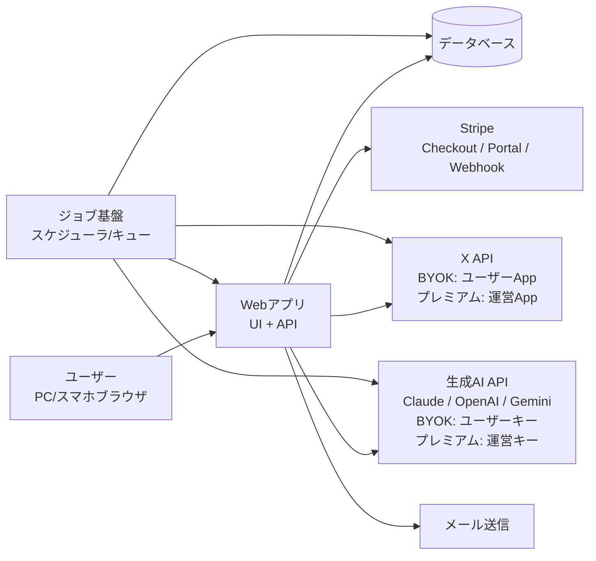

# システムアーキテクチャ

- ステータス: Draft（技術スタックはADR-0001の承認待ち。承認後にM0で確定させる）
- 最終更新日: 2026-07-19

## 1. 全体構成

PRDから導かれるシステム構成要素。技術選定は `decisions/ADR-0001-tech-stack.md` を参照。

### 構成要素

| 要素 | 責務 | PRD参照 |
|---|---|---|
| Webアプリ（UI + API） | 画面表示、認証、設定・学習、投稿生成の起動、下書き管理、分析表示 | §5全般 |
| ジョブ基盤 | ニュース定期取得（運営側・3分野×毎時、JST 9-20時）、スケジュールスロット実行、実績定期取得、失敗リトライ | N-1, S-1〜S-4, K-1, §8.3 |
| データベース | 全永続データ。エンティティは `data-model.md` 参照 | — |
| X API連携 | OAuth 2.0連携、投稿（スレッド）、過去投稿・実績読み取り。BYOK＝ユーザーのDeveloper App、プレミアム＝運営App | A-3, A-4, §8.1 |
| 生成AIプロバイダ抽象化 | Claude / OpenAI / Gemini を統一インターフェースで扱う。文章生成・Webリサーチ・画像生成（OpenAI/Geminiのみ）。プランに応じたキー解決（BYOK／運営キー） | A-5, §8.2 |
| Stripe連携 | ホスト型Checkout、7日トライアル、カスタマーポータル、Webhookによるサブスク状態同期 | O-1, §6 |
| 通知 | メール + アプリ内通知。種別ごとのON/OFF | O-2, N-3 |

## 2. 横断的関心事

### 2.1 APIキー管理と暗号化
- ユーザー登録キー（X・生成AI）は暗号化して保存。画面上は末尾4桁のみ表示（PRD §7）
- 暗号化方式・鍵管理: 未定（M0で決定しADR化）

### 2.2 プランによるキー解決
- 全てのX API・生成AI API呼び出しは「プラン → 使用キー（ユーザーキー or 運営キー）」の解決レイヤを通す
- プレミアムプランは利用上限カウンタ（O-4）をこのレイヤで消費する

### 2.3 ベースmdファイル
- Xアカウントごとに1ファイル。セクション構造で学習結果・設定・承認済み知見を保持（PRD §8.3）
- 編集履歴とロールバックを持つ（M-1, K-3）
- 保存方式: 未定（DB内テキスト＋リビジョン管理を想定。M2実装時に確定）

### 2.4 信頼性
- 自動投稿失敗時はリトライ（2回）＋ユーザー通知。冪等性キーで二重投稿を防止（PRD §7）
- スロット実行はジョブキューで管理し、失敗時の再実行・通知を行う（PRD §8.3）

## 3. 機能別アーキテクチャ

各セクションは該当マイルストーンの実装時に記述する。

- 3.1 認証・アカウント管理（M1）: 未実装
- 3.2 学習パイプラインとベースmd生成（M2）: 未実装
- 3.3 ニュース収集・配信基盤（M3）: 未実装
- 3.4 投稿生成パイプライン（M4）: 未実装
- 3.5 スケジューラ・下書き（M5）: 未実装
- 3.6 分析・学習ループ（M6）: 未実装
- 3.7 課金・利用上限（M7）: 未実装
